## Not just code farmers

程序员经常被戏称或自称为"码农"，又经常被调侃成"面向stackoverflow编程或面向google编程"。这些戏称或调侃某些时候也有它自己的道理，但如果严肃一点看这些问题，"程序员如何不止于码农？"，"程序员如何摆脱搬砖的标签？"，"编程世界新技术层出不穷，哪些知识保质期最长？"。摆脱和看清这些纷扰的最好办法就是回归到本源和经典，建立系统性知识图谱和思维方式，练好基本功，才会更好地学习和掌握新武艺。

### 简要说明

这里不会介绍和具体编程相关的书籍(比如某种语言的语法，某个框架，某个中间件)，更多是介绍一些与计算机相关的通识读物。这些通识不见得会马上让人的编程水平上一个台阶，但它确实会对编程和解决工作中的问题有帮助。这种帮助更像是一种内化的力量，就如足球运动员的力量训练，协调性训练或跑位训练，虽然并不会让人马上学会马赛大回旋或勺子点球，但的确会对技艺的提高会有帮助。

### 算法
如果你能将一个业务问题转化成代码并产生正确的结果，其实你已经会算法了。这里所说的算法是指如何更聪明地解决这些问题，例如更简洁，所耗资源更少，效率更高。已经有很多人在这样的道路上求索了，这些已经探索出来的路数，为某些通用问题给出法门，也为如何解决问题提供了不错的方法论。  

- 《算法导论》  
关于数据结构与算法的书有很多经典款，比如《计算机程序设计艺术》。不过我更推崇这本，个人觉得这本书读起来比《计算机程序设计艺术》更流畅，可能是《计算机程序设计艺术》数学公式更多或更难一些。另外，这本书从知识体系构建上来说也很好。如果读完后对排序算法，字符串算法，树和图，分治法，动态规划和贪心算法这些心里有谱，那恭喜你已经值回票价了，如果你再深入一下NP问题，那简直是物超所值。

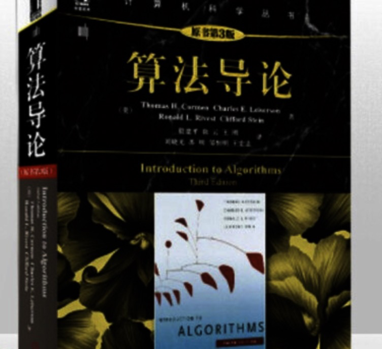

- 《算法》   
这边书可以看成《算法导论》的简版，如果你觉得《算法导论》太厚，这本书也不错。我觉得它在知识体系上不如《算法导论》，不是说它不好，它可能像九阴真经，而《算法导论》像金刚经。

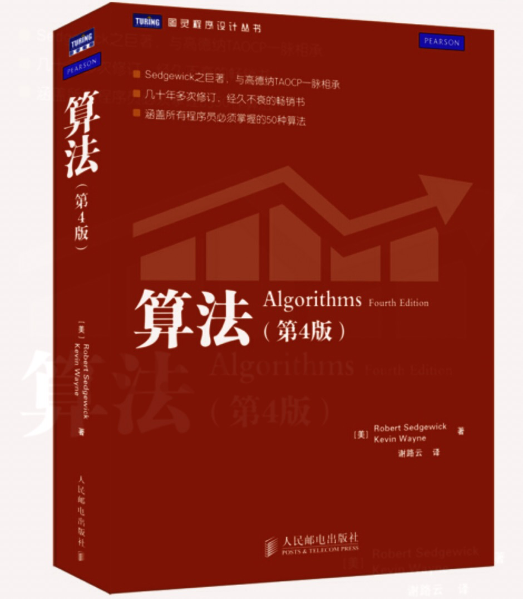

### 编程
编程是综合的，很难说拥有哪块知识面就可以一招鲜通吃，下面这几本书我觉得是对编程有益的，它们更像是编程的一些心法而非具体招式。

- 《编程珠玑》   
用"珠玑"二字，就可以看出作者的苦心和这本书的分量了。

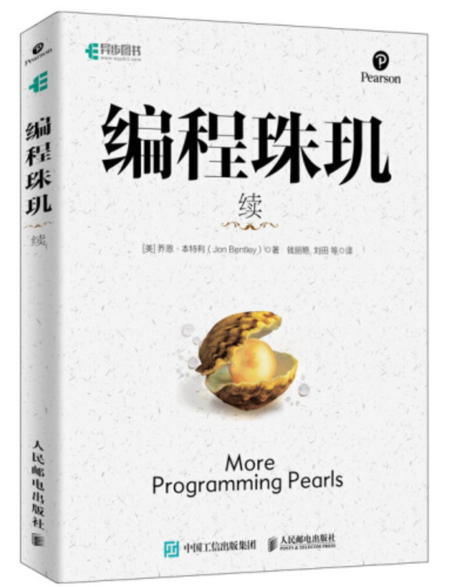

- 《代码大全》   
用"大全"二字，绝非夸夸其谈，没干货是不敢这样命名的。

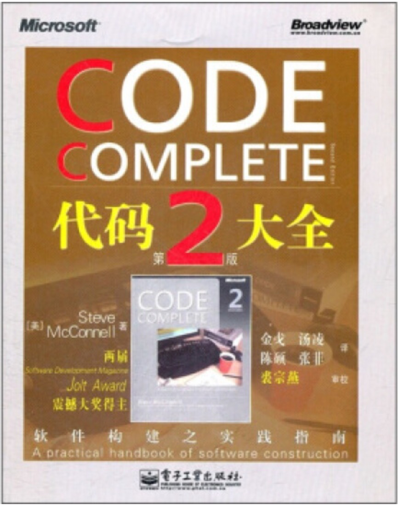

- 《C专家编程》   
  现代各个公司技术栈中涉及到的编程语言往往都没有C语言了，打个不那么恰当的比方，C语言是各种编程语言中的智人，现在各种编程语言都衍生自它。智人虽然古老，但现代人的很多特征都可以在智人的特征中找到出处。比如每种语言都有自己的异常处理，如果你在这本书看完setjmp和longjump，你可能会产生一种“原来如此”的感觉。

  ​     -- 现代人在动手能力和单独生存能力上还不如智人，智人看上去虽然不如现代人聪明，但实际上智人能凭个人能力打造任何武器，而现代人虽然各有侧重，但一旦走出自己领域就变白痴。这个智人与现代人的比喻可能不那么恰当，如果抛开开发效率，论语言本身的能力，C语言当执牛耳；当然C语言挖坑能力也是杠杠的。

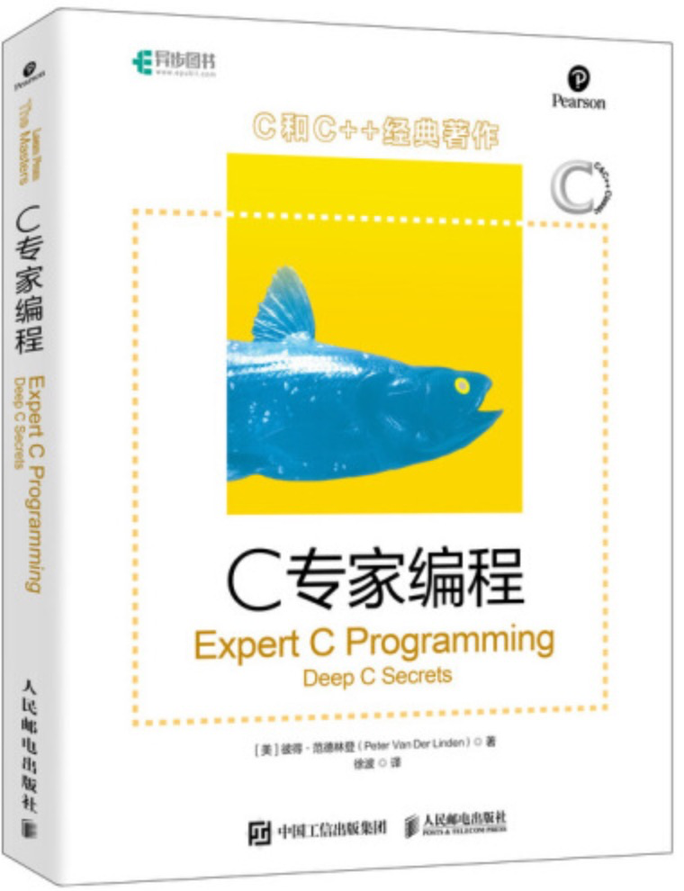

### 计算机基础
现代编程技术栈的发展非常快，已经细分出不同层次。比如系统层，应用层，在系统和应用之间，还有很多中间件充当中间层。对于只在应用层上工作的人来说，理解下面的层次看上去也不是那么急迫。如果只是"know how"，那看一下API手册或一些常用的库和第三方的文档就可以了。但如果想"know why"并对应用层日新月异的变化不那么困惑，那回归到基础知识是一个不错的方法。

- 《计算机体系结构精髓》   
英文里太阳系叫"Solar System"，这里System就是体系的意思。对于程序员来说，计算机体系结构就是"Solar System"。这本书里面很多知识不见得会在编写代码时立即用到，但请相信它在意的是内化的知识，是润物无声的理论。

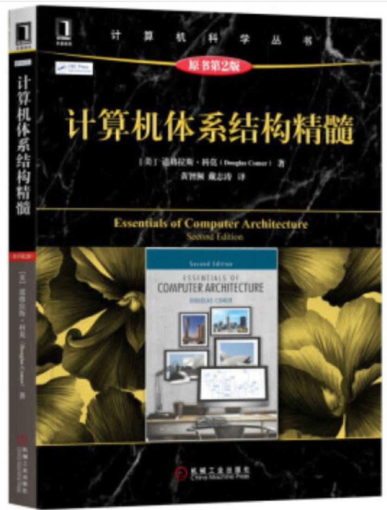

- 《深入理解计算机系统》  
和《计算机体系结构精髓》一样，这本书会让你拥有透视眼。

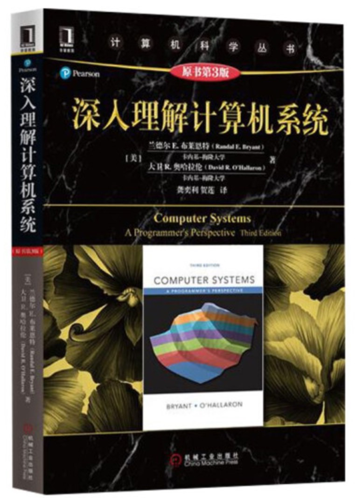

- 《计算机网络自顶向下方法》   
这里把计算机网络也放在计算机基础中，是因为网络太重要了，现在的计算机已经离不开网络了。讲计算机网络的书很多，比如《TCP/IP详解》卷1/2/3，但这本书是最精炼的，条理和结构都很适合阅读。

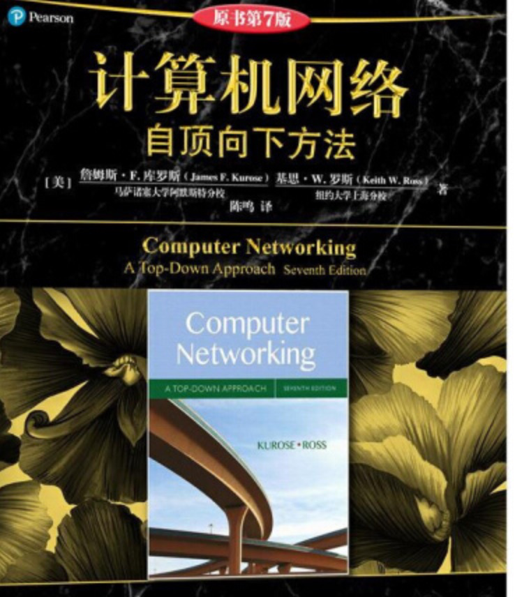

### 操作系统
操作系统对于某些应用程序开发过程来说，已经成了透明人了，很多程序员可以在不掌握操作系统知识的情况下完成工作。但如果你想真正吃透进程与线程，同步与互斥问题，计算机网络，内存管理，文件系统，那值得读一读相关的书籍。当你完成了一些应用的开发后，如果能想象出它如何利用了下层系统的接口，以怎样的形态和过程完成它的使命时，很有可能会有一种悟道的感觉，并能以正确的开箱方式对待第三方库和系统库。

- 《操作系统 -- 精髓与设计原理》   
这本书我在上学期间就读完了，真正对我有帮助时在我刚开始工作的时候，它帮助我解决了嵌入式里中断处理和Windows多线程开发中遇到的困惑。

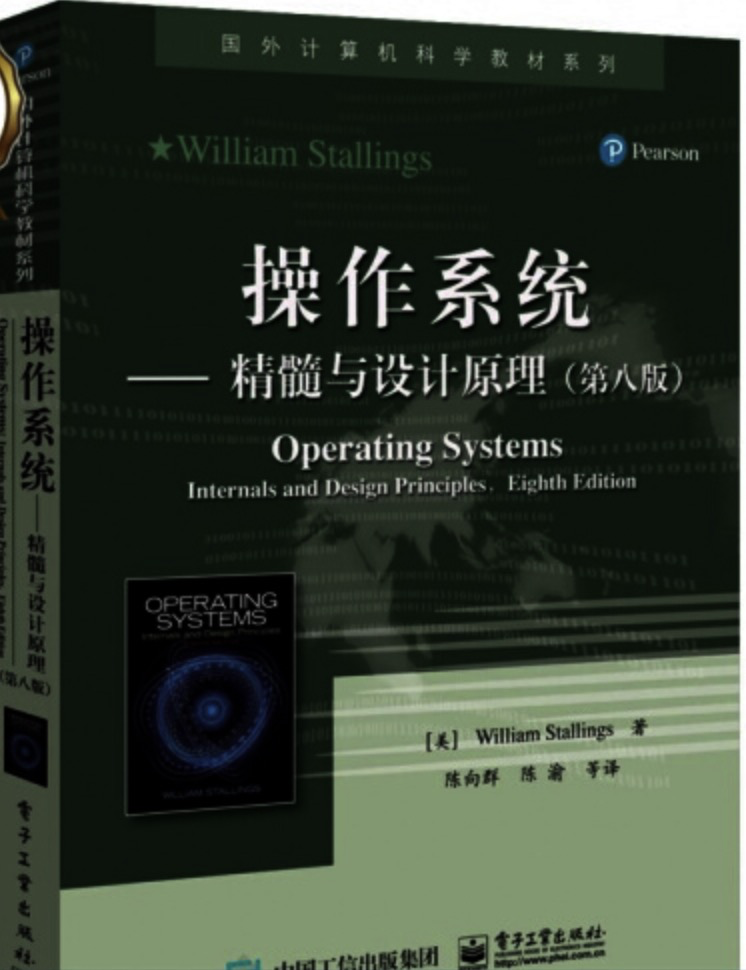

- 《Unix环境高级编程》   
这本书是从系统调用和接口的角度去探视了类Unix的系统设计，不得不说，Unix系统接口是我看到最简洁和优雅的，古典而从不过时。服务端流行的Linux，移动端流行的iOS，Android，PC端流行的MacOS，游戏主机的PS，都源起Unix，这本书讲述的知识经典而永不过时。

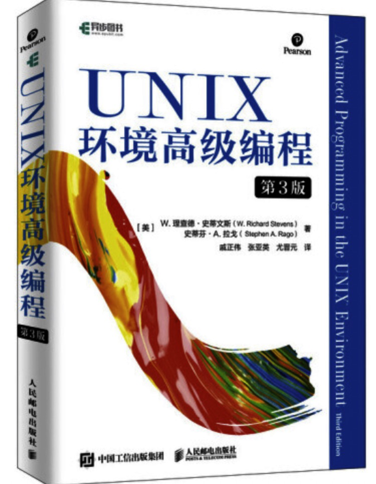

- 《Linux内核设计与实现》  
这本书篇幅不算多，非常精干。Linux内核的书很多，这本书将整个内核脉络梳理得很好，并用不多的篇幅诠释的非常清楚。

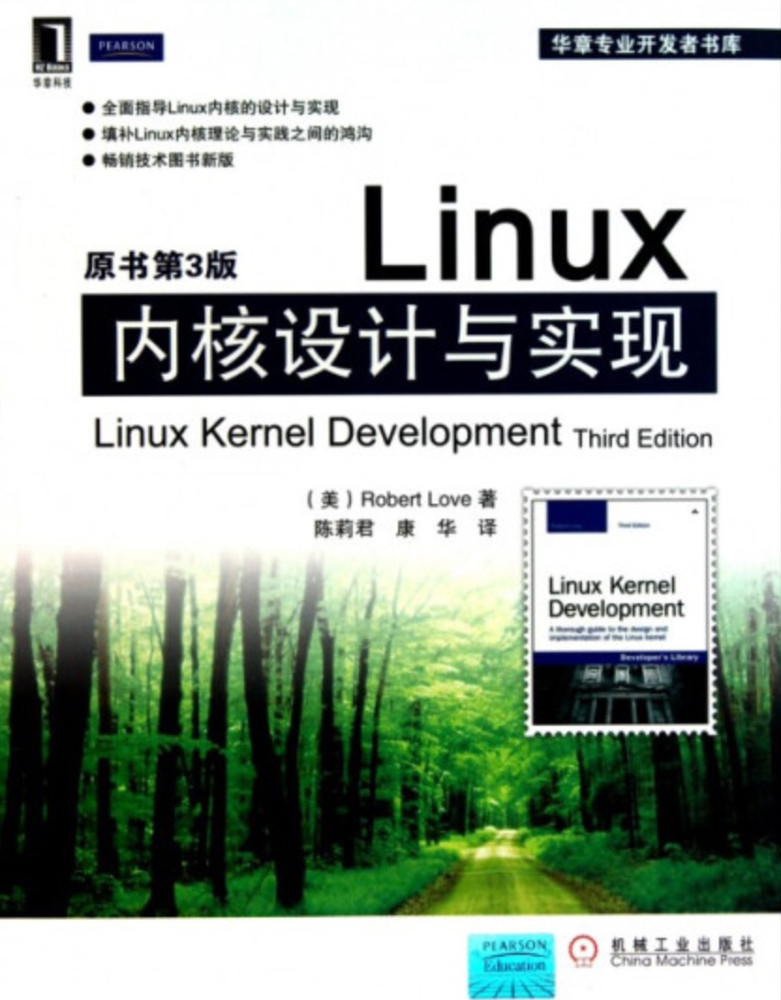

### 数据库

很多后端程序员常常被调侃成CRUD程序员，这里的CRUD(Create/Read/Update/Delete)指的是对数据库的4种操作。但被忽视的是，如果我们不足够了解数据库，极有可能在CRUD上踩坑。

- 《数据库系统概念》   
如果对数据库系统没有全面视图上的概念，这本书值得一读。

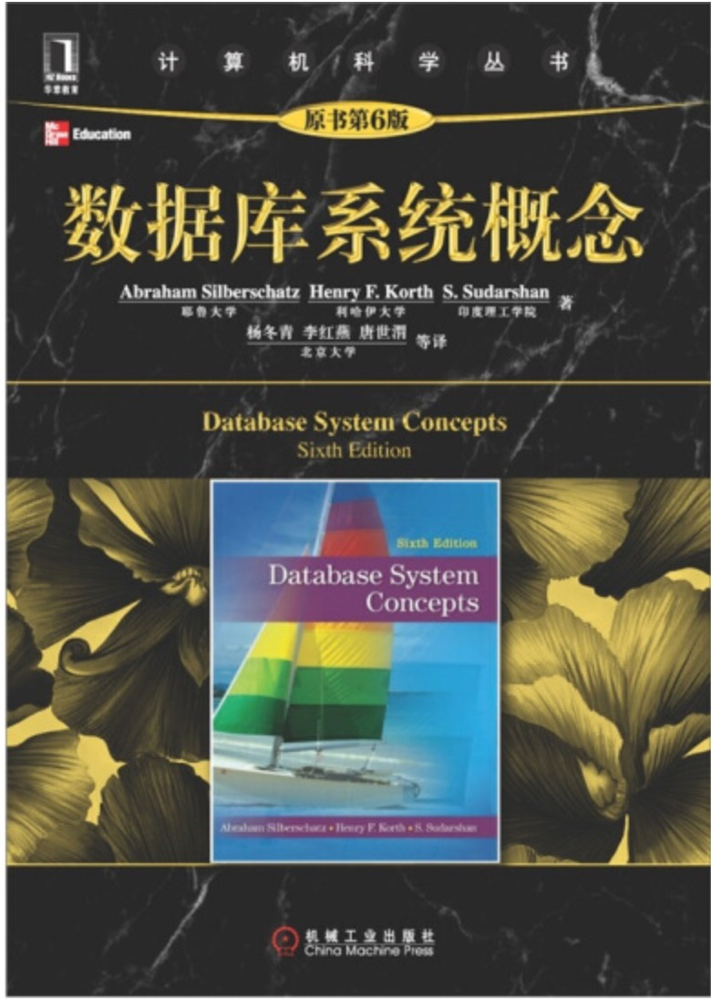

- 《MySQL技术内幕 InnoDB存储引擎》    
如果你只是需要用MySQL，可以读《MySQL必知必会》这类的书籍。但你想更进一步，或者想知道一个数据库是如何运转的，那这本书值得一读。

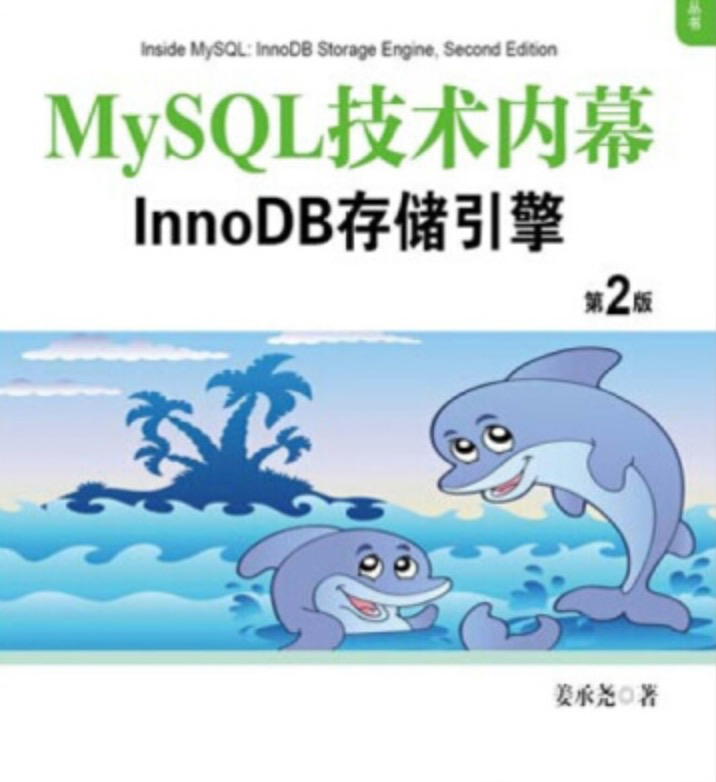

### 分布式

现在互联网系统的开发已经离不开分布式了，甚至可以说分布式计算技术的发展促进了互联网的蓬勃升级。就连在火爆的区块链技术中，分布式技术都是很重要的环节。

- 《分布式计算 原理、算法与系统》   
坦率说，这本书很理论，甚至有些晦涩。如果你愿意花时间啃下去，你会收获很多。

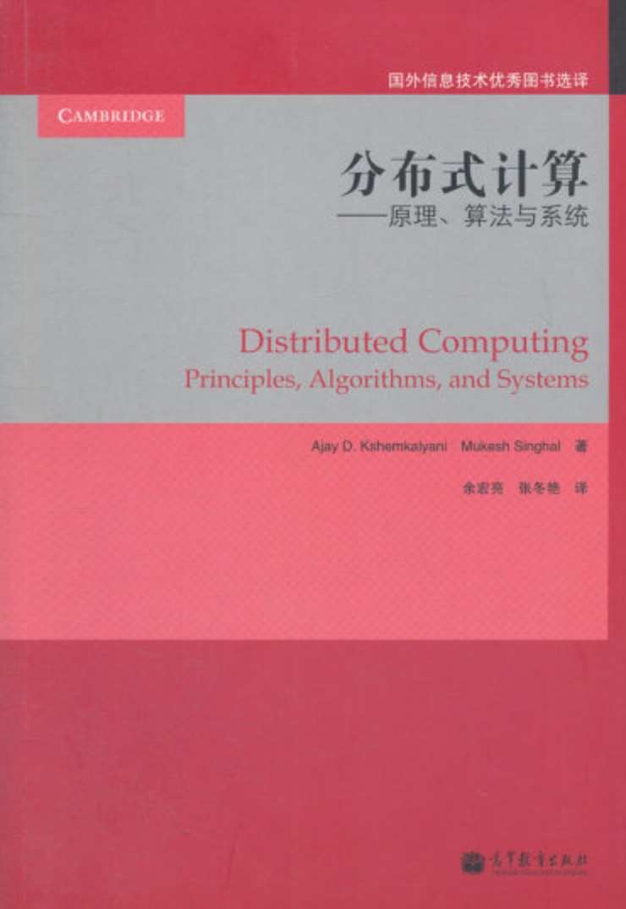

- 《数据密集型应用系统设计》   
大多数分布式应用其实都是数据密集性应用，想一下facebook/twitter/微信/淘宝，其实都是这类应用。这本书就围绕分布式数据存储的方面展开，对于我们要做的各种应用都有直接的借鉴意义。

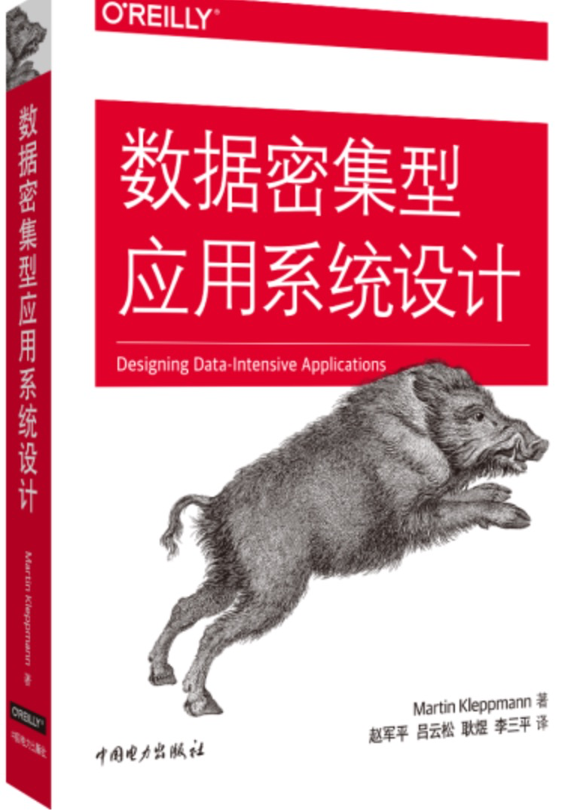

- 《分布式系统与一致性》   
一致性是分布式系统中非常大的一个挑战，在每个分布式系统中都会看到它的身影。

### 其它

有些书可能不会马上对编程提高有立竿见影的效果，但它们的知识是有用的。

- 《编程之美》   
这本书主要是列举了一些微软面试题，适合闲暇时光烧一下脑，毕竟脑子有时烧一烧会更灵动。

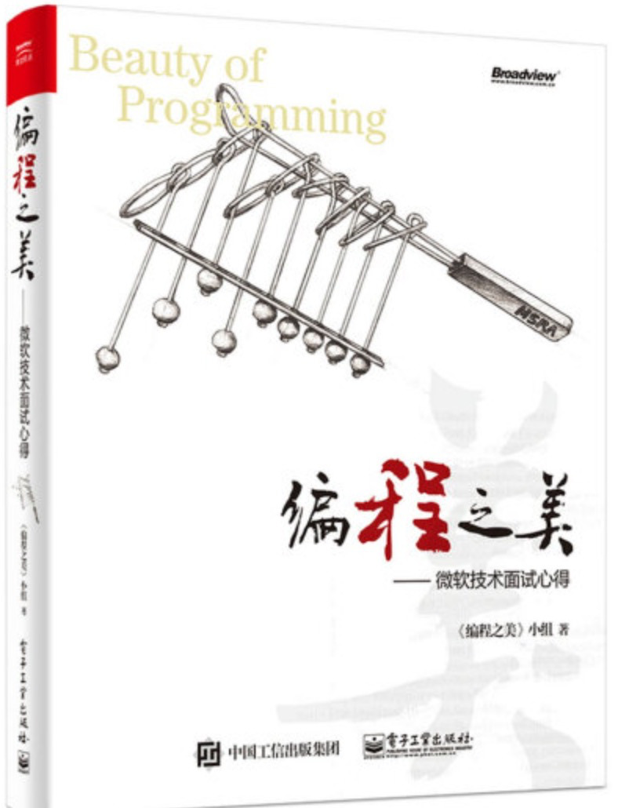

- 《计算机科学中的数学》   
数学在大多数时候看上去都没有用，我说的只是"看上去"。某种程度上，现代计算机的发展好像进入了深水区。编程技能(诸如if/else之类的逻辑推理)相当于普通的船舰，数学技能却能造出潜水艇。数学的学习路径很长，这本书直接点明了与计算机相关的数学技能。

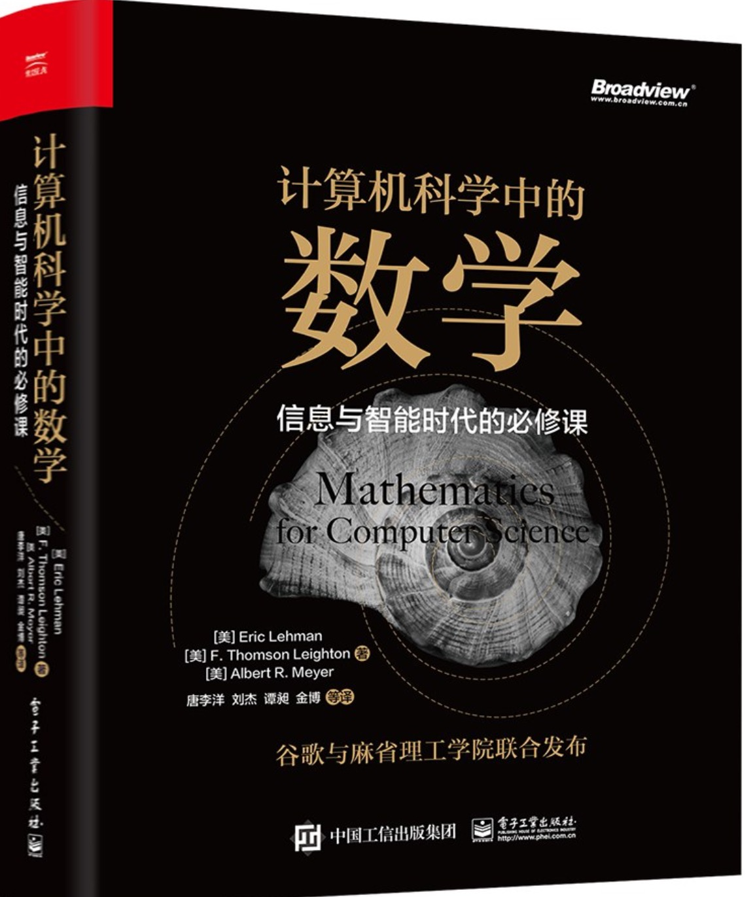

- 《具体数学 计算机科学基础》   
这本书算得上经典了，作者葛立恒(Ronald L. Graham)，高德纳(Donald E. Knuth)，高德纳不用说了，葛立恒呢，葛立恒数(Graham's Number)不是开脑洞，是把脑开成黑洞。

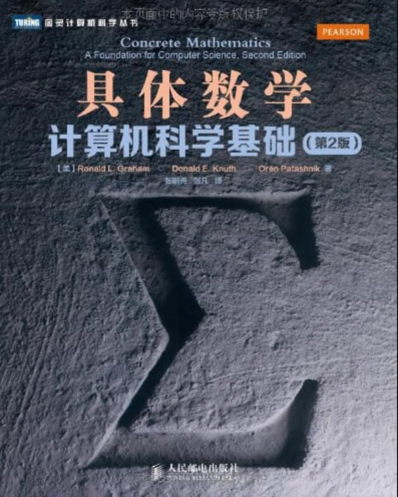

- 《数学与泛型编程 高效编程的奥秘》    
C++有泛型，java有泛型，很多语言都有泛型，这本书说的是编程本身的泛型而不是语言的泛型。

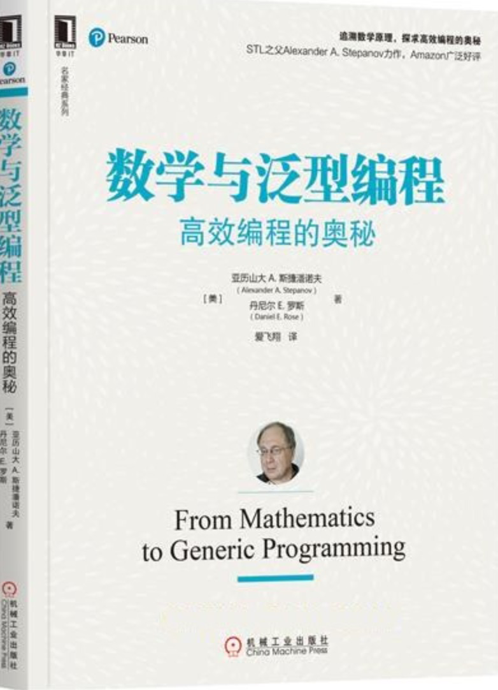

- 《编程原本》   
欧几里得有《几何原本》，能叫原本，都是很厉害的。

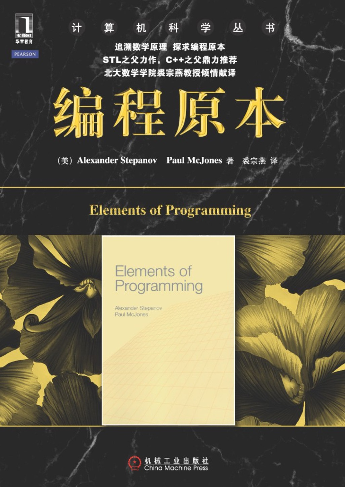

- 《数值分析》   
数值计算这门课在上学时是选修，不想被数学继续折磨的我没有选修。2014年从嵌入式转做游戏时觉得可能会用上数值计算，于是抖机灵买了这本《数值分析》。在游戏代码里的确用到了这本书的两项内容，1是贝塞尔曲线，2是解方程判断曲线与直线是否相交。如果你想要触碰现在最火的机器学习，这门课绕不过去。

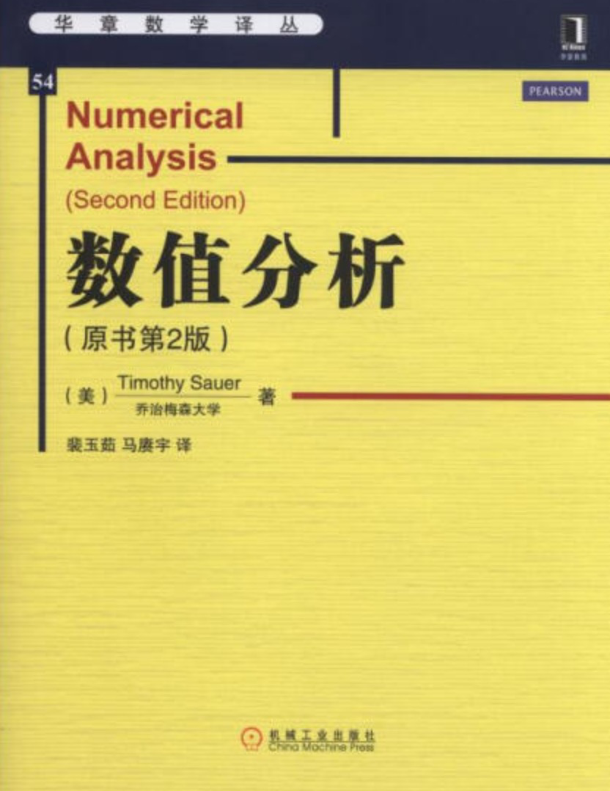

### 写在结尾

个人认为在数月内就把这些吃透应该是很难的，有计划地推进学习这些内容总归是有益处的。B站上可能有不错的UP主讲这些相关内容，视频学习也是很不错的路子。看视频可能比看书快，但忘的也快，如果在看视频时能做做笔记，哪怕就是按下暂停键，在纸上比划几下，也会加深记忆。

