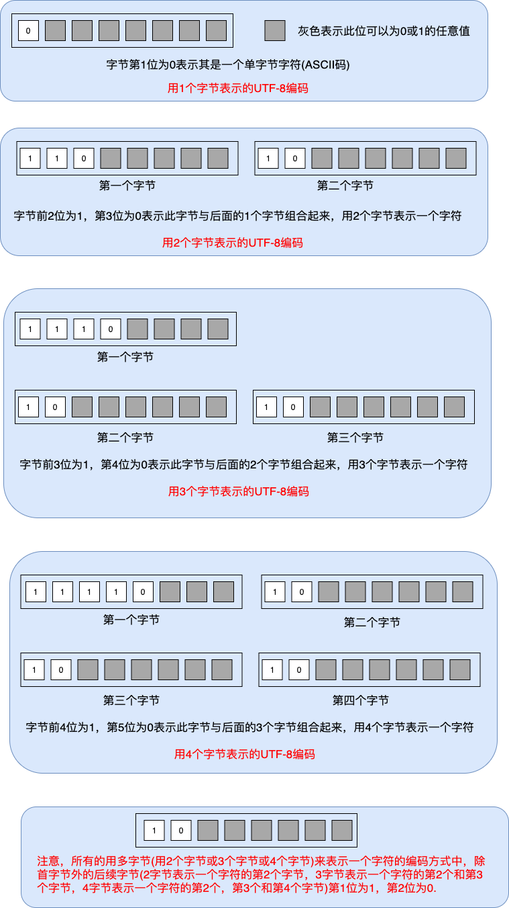

## MySQL字符集

### [Unicode](https://zh.wikipedia.org/wiki/Unicode)和[UTF-8](https://zh.wikipedia.org/wiki/UTF-8)

计算机由西方人发明，在做字符串处理时，用[ASCII](https://zh.wikipedia.org/wiki/ASCII)就搞定了，因为拉丁字母就26个，加上一些控制字符，用1个字节就搞定了。但如果要让计算机处理其它国家和地区的文字时，ASCII肯定不够用了，光是汉字，就已经过万。各个国家在发展自己的字符串编码时，出现了不同的体系与标准。不同的国家有不同的字母，例如130在法语编码中代表了字母é，在希伯来语编码中却代表了字母ג。在这些不同的编码方式，同一个二进制数字可以被解释成不同的符号。要想打开一个文本文件，就必须知道它的编码方式，否则用错误的编码方式解读，就会出现乱码，这像极了[巴别塔问题](https://zh.wikipedia.org/wiki/%E5%B7%B4%E5%88%A5%E5%A1%94)。   
就如发明世界语一样，总有人或组织想站出来解决这样的问题，但显然，这个问题比普及世界语容易。ISO(国际标准化组织)着手解决这个问题，方法很简单：废了所有的地区性编码方案，重新搞一个包括了地球上所有文化、所有字母和符号的编码！名字叫”Universal Multiple-Octet Coded Character Set”，简称UCS, 俗称“unicode”。要表示地球上所有的字母和符号，最多4个字节就够了。   
Unicode解决了字符与符号内置映射的问题，即一个字符串或符号能找到一个表示它的整数值。但在实际的使用过程中，如何来编码这些整数又是一个问题。假如都用4个字节来表示一个字符或符号(UTF-32就是这样的方式)，那会出现大量的空间浪费，例如'ABCD'这个字符串，就需要16个字节表示，实际上用4个字节就足够表示了。后面也出现了类似UTF-16这样的编码方式，字符用两个字节或四个字节表示，比起UTF-32来说，这样的确节约出了一些空间，但真正流行起来并成为主流的编码方式是UTF-8。   
UTF-8使用1到4个字节来对Unicode进行可变长度的编码(protobuf协议中整数缺省也被编码成变长的)，它是一种前缀码。简单来说，UTF-8使用了字节中前几位来标识其编码：

- 如果第1位为0，此字节表示1个ASCII码
- 如果前两位为1，第三位为0，表示用两个字节来表示此字符
- 如果前三位为1，第四位为0，表示用三个字节来表示此字符
- 如果前四位为1，第五位为0，表示用四个自己来表示此字符
- 在采用多字节表示一个字符的任何非首字节都用第一位为1，第二位为0的方式来标识


截止到2019年11月，在所有网页中，UTF-8编码应用率高达94.3%（其中一些仅是ASCII编码，因为它是UTF-8的子集），而在排名最高的1000个网页中占96％。UTF-8不见的是字符编码的终极方案，但看上去它会在很长一段时间都是主流。随便提一下，现在新的编程语言都默认使用UTF-8来处理字符串，UTF-8已经成了事实上的主流字符编码标准了。以前的字符串编码处理要麻烦的多，比如早些年的Windows上的软件开发在做多语言的时候，不但要切换各种字符集，还要切换codepage。python2.7代码中要定义中文字符串常量，还需要在文件头加上utf-8的标签。早些年更闹心的是在IE浏览器中打开的网页，如果网页中没有加上语言字符集的标签，在出现乱码后，还需要在菜单中选对正确的字符集(和拆盲盒没两样)。

### MySQL的字符集

用MySQL客户端登录后，输入命令，可以看到MySQL支持很多字符集。通过前面Unicode和UTF-8的简单介绍，大家应该有个基本共识就是用UTF-8做字符集。原因很简单，现在开发的系统大多都希望支持多语言，就算暂时没有多语言，也要保留后续开发多语言的权利。Unicode是最普世的字符集，试想一下，如果用简体中文编码的系统，用户有可能就不能繁体或日文等了。而用Unicode，就可以很容易地支持任何国家和地区的用户。所以，这里虽然列举了MySQL支持的字符集，实际上我们真正需要的字符集是UTF-8这种主流的字符集，其余的字符集可能只在一些特殊的场景才能用上。

```SQL
SHOW CHARACTER SET;

+----------+---------------------------------+---------------------+--------+
| Charset  | Description                     | Default collation   | Maxlen |
+----------+---------------------------------+---------------------+--------+
| big5     | Big5 Traditional Chinese        | big5_chinese_ci     |      2 |
| dec8     | DEC West European               | dec8_swedish_ci     |      1 |
| cp850    | DOS West European               | cp850_general_ci    |      1 |
| hp8      | HP West European                | hp8_english_ci      |      1 |
| koi8r    | KOI8-R Relcom Russian           | koi8r_general_ci    |      1 |
| latin1   | cp1252 West European            | latin1_swedish_ci   |      1 |
| latin2   | ISO 8859-2 Central European     | latin2_general_ci   |      1 |
| swe7     | 7bit Swedish                    | swe7_swedish_ci     |      1 |
| ascii    | US ASCII                        | ascii_general_ci    |      1 |
| ujis     | EUC-JP Japanese                 | ujis_japanese_ci    |      3 |
| sjis     | Shift-JIS Japanese              | sjis_japanese_ci    |      2 |
| hebrew   | ISO 8859-8 Hebrew               | hebrew_general_ci   |      1 |
| tis620   | TIS620 Thai                     | tis620_thai_ci      |      1 |
| euckr    | EUC-KR Korean                   | euckr_korean_ci     |      2 |
| koi8u    | KOI8-U Ukrainian                | koi8u_general_ci    |      1 |
| gb2312   | GB2312 Simplified Chinese       | gb2312_chinese_ci   |      2 |
| greek    | ISO 8859-7 Greek                | greek_general_ci    |      1 |
| cp1250   | Windows Central European        | cp1250_general_ci   |      1 |
| gbk      | GBK Simplified Chinese          | gbk_chinese_ci      |      2 |
| latin5   | ISO 8859-9 Turkish              | latin5_turkish_ci   |      1 |
| armscii8 | ARMSCII-8 Armenian              | armscii8_general_ci |      1 |
| utf8     | UTF-8 Unicode                   | utf8_general_ci     |      3 |
| ucs2     | UCS-2 Unicode                   | ucs2_general_ci     |      2 |
| cp866    | DOS Russian                     | cp866_general_ci    |      1 |
| keybcs2  | DOS Kamenicky Czech-Slovak      | keybcs2_general_ci  |      1 |
| macce    | Mac Central European            | macce_general_ci    |      1 |
| macroman | Mac West European               | macroman_general_ci |      1 |
| cp852    | DOS Central European            | cp852_general_ci    |      1 |
| latin7   | ISO 8859-13 Baltic              | latin7_general_ci   |      1 |
| utf8mb4  | UTF-8 Unicode                   | utf8mb4_general_ci  |      4 |
| cp1251   | Windows Cyrillic                | cp1251_general_ci   |      1 |
| utf16    | UTF-16 Unicode                  | utf16_general_ci    |      4 |
| utf16le  | UTF-16LE Unicode                | utf16le_general_ci  |      4 |
| cp1256   | Windows Arabic                  | cp1256_general_ci   |      1 |
| cp1257   | Windows Baltic                  | cp1257_general_ci   |      1 |
| utf32    | UTF-32 Unicode                  | utf32_general_ci    |      4 |
| binary   | Binary pseudo charset           | binary              |      1 |
| geostd8  | GEOSTD8 Georgian                | geostd8_general_ci  |      1 |
| cp932    | SJIS for Windows Japanese       | cp932_japanese_ci   |      2 |
| eucjpms  | UJIS for Windows Japanese       | eucjpms_japanese_ci |      3 |
| gb18030  | China National Standard GB18030 | gb18030_chinese_ci  |      4 |
+----------+---------------------------------+---------------------+--------+
```

### MySQL的字符集的坑

**MySQL的UTF-8不是真正的UTF-8？** 是的，的确如此。这是一个相当让人困扰的情况，本质上，MySQL的UTF-8字符集可以看成是真正UTF-8的一个子集，它实际上是UTF-8中1字节/2字节/3字节编码的集合，但就缺少了4字节编码的UTF-8的字符和符号。这样的后果是，4个字节的UTF-8字符和符号不能在MySQL的UTF-8字符集下使用，比如一些在网络语言中流行的emoji表情。

这段来自wiki描述清楚说明了整个挖坑过程:

**MySQL字符编码集中有两套UTF-8编码实现：“utf8”和“utf8mb4”，其中“utf8”是一个字最多占据3字节空间的编码实现；而“utf8mb4”则是一个字最多占据4字节空间的编码实现，也就是UTF-8的完整实现。这是由于MySQL在4.1版本开始支持UTF-8编码（当时参考UTF-8草案版本为RFC 2279）时，为2003年，并且在同年9月限制了其实现的UTF-8编码的空间占用最多为3字节，而UTF-8正式形成标准化文档（RFC 3629）是其之后。限制UTF-8编码实现的编码空间占用一般被认为是考虑到数据库文件设计的兼容性和读取最优化，但实际上并没有达到目的，而且在UTF-8编码开始出现需要存入非基本多文种平面的Unicode字符（例如emoji字符）时导致无法存入（由于3字节的实现只能存入基本多文种平面内的字符）。直到2010年在5.5版本推出“utf8mb4”来代替、“utf8”重命名为“utf8mb3”并调整“utf8”为“utf8mb3”的别名，并不建议使用旧“utf8”编码，以此修正遗留问题。**


**用utf8mb4，用utf8mb4，用utf8mb4，重要的事情说三遍。MySQL的utf8mb4才是真正的UTF-8。** 

### MySQL的字符集的排序规则

字符集的排序规则是指给定在此字符集中任意两个字符串进行比较，总能获取到"<"或">"或"=="三个结果中的一个。例如，给定字符串'ABC'和'你好'，能判断出它们的先后顺序。直观来说，对字符串最简单的比较方法就是比较编码，例如对于字符'a'和'b'，它们的ASCII码和UTF-8码都是一个字节，分别是61和62，可以很容易地得出'a'<'b'这样的结论，很明显，'a'=='a'(61==61)，'b'=='b'(62==62)。但在真实的世界，这样简单粗暴地排序并不完美。在很多情况下，对字母的排序并不区分大小写，例如，在电子邮件账号中并不对大小写做任何区分，域名也不区分大小写。在某些语言体系中，例如德语，不仅是区分大小写，还有是否区分重音(（“重音”是德语中附加在字符上的标记Ö)，以及多字符映射(例如Ö=OE这样的规则)。

MySQL的字符集排序规则使用了一些特定的后缀命名来表示不同的意义：

|  后缀   | 意义        |
|  ----  | ----        |
| _bin   | 二进制       |
| _ci    | 不区分大小写  |
| _cs    | 区分大小写    |
| _ai    | 口音不敏感    |
| _as    | 口音敏感     |

- 二进制是指按字符在字符集编码中的数值进行比较，比如'A'的编码数值是65，'a'的编码数值是97，它们的比较结果就是'A'<'a'。
- 区分大小写与不区分大小写很容易理解，区分大小写的情况下'A'<'a'，不区分大小写的情况下'A'=='a'。
- 口音不敏感与口音敏感多数在西欧的一些语言中使用，我们几乎不会涉及这类场景，这里不做过多表述。
- 二进制的比较是最严格的，不但区分大小写，也区分口音。

### MySQL的字符集的排序规则的作用域

MySQL字符集排序规则作用在对字符串进行比较和排序的部分，用来判断两个字符串是否相等，亦或谁大谁小。排序规则不会影响字符串的存储，比如选定不区分大小写的排序规则后，在数据库中写入的字符串的大小写保持不变。假如写入数据库的字符串为"AbC"，它还是会被存储成"AbC"，这3个字母的大小写并不会因为不区分大小写的排序规则而改变。唯一影响的是，如果拿"AbC"与"abc"/"ABC"/...这样的字符串进行比较，不区分大小写的排序规则会认为它们是相同的。   

下面以不区分大小写排序规则下CRUD为例子来说明排序规则的作用：  
1. CREATE：当使用INSERT这样的SQL语句新建记录时，需要用到比较功能的其实是和索引有关。也即是说，如果插入的数据中字符串字段没有建立索引，那就不会对此字符串进行比较操作，这时此字段的字符串排序规则并不会被使用。  
   索引又分为唯一索引(unique key，主键也是唯一索引)和一般索引。  
   如果是一般索引，不区分大小写的比较方式会以不区分大小写的方式来排定插入的字符串字段的位置，例如，插入数据'A'和'a'，这两条数据会在相邻的位置，效果与插入数据'A'，再插入数据'A'类似。  
   如果是唯一索引，插入数据'A'和'a'的结果是，第一个'A'被插入，第二个'a'基于排序规则判断与'A'相等，会报Duplicate的错误而插不进去。
2. UPDATE：当使用UPDATE这样的SQL语句修改记录时，用到比较功能可能会在两个地方：  
   1）被修改的字段有索引，只有被修改的字段有索引，更新数据才会去更新相关的索引树。索引树更新的相关规则和INSERT方式类似，假如库中已经存在了'A'这条记录，如果要把另外一条'B'记录更新成'a'，如果此字段非唯一索引，那索引树更新的结果是'A'和'a'的索引会在相邻位置；如果是唯一索引，这样的更新会失败，同样报Duplicate的错误。
   2）WHERE子句，如果WHERE子句中相关的字段是字符串字段，此时WHERE选定的数据是基于不区分大小写的比较结果。假如WHERE子句是"WHERE fieldA='a'"，而此时数据库中已经有的相关记录有两条，分别是'A'和'a'，则WHERE子句会选中这两条记录一同更新。
3. DELETE：删除记录用到比较功能的地方就在WHERE子句中，其行为与上面描述的WHERE子句行为一样。
4. READ：使用SELECT这样的SQL语句需要用到比较功能的地方也在WHERE子句部分，与上面描述的行为一样。

总的来说，需要用到比较规则的地方就在两个点：
1）写入数据(INSERT/UPDATE)时，写入的字段有索引。
2）WHERE子句中引用的字段需要比较功能。

### utf8mb4支持的排序规则

输入命令，可以看到MySQL(5.7)在utf8mb4下的排序规则

```SQL
SHOW COLLATION WHERE Charset = 'utf8mb4';
+------------------------+---------+-----+---------+----------+---------+
| Collation              | Charset | Id  | Default | Compiled | Sortlen |
+------------------------+---------+-----+---------+----------+---------+
| utf8mb4_general_ci     | utf8mb4 |  45 | Yes     | Yes      |       1 |
| utf8mb4_bin            | utf8mb4 |  46 |         | Yes      |       1 |
| utf8mb4_unicode_ci     | utf8mb4 | 224 |         | Yes      |       8 |
| utf8mb4_icelandic_ci   | utf8mb4 | 225 |         | Yes      |       8 |
| utf8mb4_latvian_ci     | utf8mb4 | 226 |         | Yes      |       8 |
| utf8mb4_romanian_ci    | utf8mb4 | 227 |         | Yes      |       8 |
| utf8mb4_slovenian_ci   | utf8mb4 | 228 |         | Yes      |       8 |
| utf8mb4_polish_ci      | utf8mb4 | 229 |         | Yes      |       8 |
| utf8mb4_estonian_ci    | utf8mb4 | 230 |         | Yes      |       8 |
| utf8mb4_spanish_ci     | utf8mb4 | 231 |         | Yes      |       8 |
| utf8mb4_swedish_ci     | utf8mb4 | 232 |         | Yes      |       8 |
| utf8mb4_turkish_ci     | utf8mb4 | 233 |         | Yes      |       8 |
| utf8mb4_czech_ci       | utf8mb4 | 234 |         | Yes      |       8 |
| utf8mb4_danish_ci      | utf8mb4 | 235 |         | Yes      |       8 |
| utf8mb4_lithuanian_ci  | utf8mb4 | 236 |         | Yes      |       8 |
| utf8mb4_slovak_ci      | utf8mb4 | 237 |         | Yes      |       8 |
| utf8mb4_spanish2_ci    | utf8mb4 | 238 |         | Yes      |       8 |
| utf8mb4_roman_ci       | utf8mb4 | 239 |         | Yes      |       8 |
| utf8mb4_persian_ci     | utf8mb4 | 240 |         | Yes      |       8 |
| utf8mb4_esperanto_ci   | utf8mb4 | 241 |         | Yes      |       8 |
| utf8mb4_hungarian_ci   | utf8mb4 | 242 |         | Yes      |       8 |
| utf8mb4_sinhala_ci     | utf8mb4 | 243 |         | Yes      |       8 |
| utf8mb4_german2_ci     | utf8mb4 | 244 |         | Yes      |       8 |
| utf8mb4_croatian_ci    | utf8mb4 | 245 |         | Yes      |       8 |
| utf8mb4_unicode_520_ci | utf8mb4 | 246 |         | Yes      |       8 |
| utf8mb4_vietnamese_ci  | utf8mb4 | 247 |         | Yes      |       8 |
+------------------------+---------+-----+---------+----------+---------+
```

从排序规则上看，需要关注的主要有utf8mb4_general_ci/utf8mb4_bin/utf8mb4_unicode_ci，其余都是针对西欧的一些语言的排序规则，这些规则并不具备对大多数语言的普适性，如果需要有这样的应用场景，例如建立德语DIN-2(电话簿)排序，最好是通过特殊的代码和另外的存储方式来实现，而不必破坏整个系统的字符集和排序体系。

utf8mb4_bin是二进制排序，理论上这应该是最快的排序方式，它无需对字符做任何映射处理，只需要比较其类在编码就可以了。utf8mb4_general_ci与utf8mb4_unicode_ci从字面上看，都是不区分大小写的排序。从MySQL官方的文档的描述来看，utf8mb4_general_ci比utf8mb4_unicode_ci效率高，但准确性稍差，原因是utf8mb4_unicode_ci支持字符扩展和别的映射规则。比如，在德语和其他一些语言中ß等于ss，另外utf8mb4_unicode_ci还支持收缩和可忽略的字符。utf8mb4_general_ci是不支持扩展、收缩或可忽略字符的旧排序规则，它只能在字符之间进行一对一的比较。utf8mb4_general_ci对德语和法语都令人满意，只是ß等于s，而不是ss。如果这可以接受的，那就应该使用utf8_general_ci 它，因为它更快。

### MySQL字符集作用域

- 元数据的字符集   
  元数据是“关于数据的数据”，凡是描述和定义数据库本身的数据都是元数据。比如列名，数据库名，用户名，版本名和大多数系统变量都是元数据。MySQL使用了utf8(在MySQL的语义下，这是阉割版的utf-8，只支持最多3字节长度的编码)，事实上，这完全足够了，毕竟正常情况下，我们一般都使用ASCII范围的字符来定义元数据，不会用emoji表情去定义它。

- 连接的字符集和排序规则   
  连接字符集规则是指mysql客户端在与mysql服务端进行连接时的字符集和排序规则约定，基本上客户端与服务器连接约定的字符集需要与真实数据库连接一致。不然，会出现编码不兼容不能解析导致乱码的情况。**连接的排序规则在具体的场景中意义不大**，它只对文字之间的字符串比较有效，对于字符串与列值之间的比较，则是遵循列值自己的排序规则，常规的字符串比较相关的操作其实都与列有关，例如我们新加某条记录会带上相应的列值，修改某个列值，查找/删除/修改相关的WHERE子句会带上某个列值相关的条件(例如，用上'>','>=','<','<=','=',between这些与某个列值做比较的运算符)。


- 服务器缺省的字符集和排序规则
  MySQL服务器在编译时可以通过编译选项指定字符集和排序规则：
  ```bash
  cmake . -DDEFAULT_CHARSET=utf8mb4 -DDEFAULT_COLLATION=utf8mb4_general_ci
  ```

  在MySQL的配置文件中或启动参数中也可以修改此配置，例如
  ```
  [mysqld]
  character-set-server=utf8mb4
  collation-server=utf8mb4_general_ci
  ```

- MySQL5.7的缺省配置    
  MySQL5.7服务器缺省使用的字符集是utf8mb4，而对客户端连接缺省使用的是utf8。
  ```SQL
  show variables like 'character%';
  +--------------------------+-----------------------------------+
  | Variable_name            | Value                             |
  +--------------------------+-----------------------------------+
  | character_set_client     | utf8                              |
  | character_set_connection | utf8                              |
  | character_set_database   | utf8mb4                           |
  | character_set_filesystem | binary                            |
  | character_set_results    | utf8                              |
  | character_set_server     | utf8mb4                           |
  | character_set_system     | utf8                              |
  | character_sets_dir       | /www/server/mysql/share/charsets/ |
  +--------------------------+-----------------------------------+
  
  show variables like '%collation%';
  +----------------------+--------------------+
  | Variable_name        | Value              |
  +----------------------+--------------------+
  | collation_connection | utf8_general_ci    |
  | collation_database   | utf8mb4_general_ci |
  | collation_server     | utf8mb4_general_ci |
  +----------------------+--------------------+
  ```
  现在详细介绍一下这些变量的含义：
  |  变量                        | 意义                                                         |
  |  ----                       | ----                                                         |
  | character_set_client        | 当前客户端使用的字符集                                          |
  | character_set_connection    | 当前连接使用的字符集                                            |
  | character_set_database      | 数据库默认字符集                                               |
  | character_set_filesystem    | 把os上文件名转化成此字符集，默认binary是不做任何转换                |
  | character_set_results       | mysql server把结果集和错误信息转换为成指定的字符集并发生给客户端     |
  | character_set_server        | mysql server默认字符集                                        |
  | character_set_system        | 系统元数据(字段名等)字符集，参考上面元数据的字符集的描述              |
  | character_sets_dir          | 数据库配置目录                                                 |
  | collation_connection        | 当前连接的字符串排序规则                                         |
  | collation_database          | 数据库默认字符串排序规则                                         |
  | collation_server            | mysql server默认字符串排序规则                                  |

  从这些变量的值中可以看出mysql5.7在服务端使用了utf8mb4作为默认的字符集，并采用utf8mb4_general_ci作为默认的字符串排序规则。对于mysql客户端，则采用了utf8作为默认的字符集，并用utf8_general_ci作为默认的字符串排序规则。实际上，大部分时候都不需要显式指定字符串排序规则，因为每一种字符集都有其默认的排序规则，例如utf8mb4其默认排序规则为utf8mb4_general_ci，utf8其默认排序规则为utf8_general_ci。

  可以通过几种方式修改客户端的字符集，注意，**这里的客户端是指mysql这个命令工具**，在MySQL相关的客户端API库中(例如go语言，PHP语言的mysql库)则需要显式加上字符集配置：
  1. 修改配置文件my.cnf，添加上"default-character-set = utf8mb4"
  ```ini
  [client] 
  ...
  default-character-set = utf8mb4
  ```
  2. 在mysql命令行中带上参数default-character-set
  ```bash
  mysql -h 127.0.0.1 -uroot --default-character-set=utf8mb4 -p
  ```
  3. 通过命令行连接后，在交互式界面中输入
  ```SQL
  SET NAMES 'utf8mb4';
  ```

  在做了上面任意一步后，再次查看这些相关的系统变量，可以发现当前连接的客户的字符集与排序规则已经改变了。
  ```SQL
  show variables like 'character%';
  +--------------------------+-----------------------------------+
  | Variable_name            | Value                             |
  +--------------------------+-----------------------------------+
  | character_set_client     | utf8mb4                           |
  | character_set_connection | utf8mb4                           |
  | character_set_database   | utf8mb4                           |
  | character_set_filesystem | binary                            |
  | character_set_results    | utf8mb4                           |
  | character_set_server     | utf8mb4                           |
  | character_set_system     | utf8                              |
  | character_sets_dir       | /www/server/mysql/share/charsets/ |
  +--------------------------+-----------------------------------+
  
  show variables like '%collation%';
  +----------------------+--------------------+
  | Variable_name        | Value              |
  +----------------------+--------------------+
  | collation_connection | utf8mb4_general_ci |
  | collation_database   | utf8mb4_general_ci |
  | collation_server     | utf8mb4_general_ci |
  +----------------------+--------------------+
  ```

### MySQL的字符集和排序规则配置作用域

- MySQL服务器有默认的相关字符集和排序规则(可以通过配置文件或启动命令行参数修改)
- MySQL创建database(schema/库)时可以指定字符集和排序规则，如果没有指定，使用服务器默认配置
- MySQL创建table(表)时可以指定字符集和排序规则，如果没有指定，使用database的字符集和排序规则
- MySQL创建表时可以指定某个字段的字符集和排序规则，如果没有指定，使用table的字符集和排序规则

### MySQL字符集的相关的命令

- 如果要修改服务器级别的字符集与字符排序规则的设置，最好修改my.cnf配置文件，修改后重启。

- 其余数据库/表/列级别的修改在mysql交互命令中就可以完成。

- 修改服务器级别的配置，不会对现有库的配置产生影响，只会对新建的库产生影响。

- 修改库级别的配置，不会对现有的表产生影响，只会对新建的表产生影响。

- 修改表的配置，不会对现有列产生影响，只会对新建的列产生影响。

- 要想修改现有的列的配置，需要直接对此列进行修改。

```SQL
--查看系统中与字符集相关的变量
show variables like 'character%';

--查看系统中与字符排序规则相关的变量
show variables like '%collation%';

--查看某个库(database/schema)相关的字符集与字符排序规则的设置
use information_schema;
select * from SCHEMATA where SCHEMA_NAME='your_database';
+--------------+---------------+----------------------------+------------------------+
| CATALOG_NAME | SCHEMA_NAME   | DEFAULT_CHARACTER_SET_NAME | DEFAULT_COLLATION_NAME |
+--------------+---------------+----------------------------+------------------------+
| def          | your_database | utf8mb4                    | utf8mb4_general_ci     |
+--------------+---------------+----------------------------+------------------------+

--查看某个表相关的字符排序规则的设置
--这个例子中从表的排序规则Collation的值可以看出它的字符集为utf8
show table status from your_database like 'your_table'\G;
*************************** 1. row ***************************
           Name: your_table
         Engine: InnoDB
        Version: 10
     Row_format: Dynamic
           Rows: 3
 Avg_row_length: 5461
    Data_length: 16384
Max_data_length: 0
   Index_length: 65536
      Data_free: 0
...
      Collation: utf8_general_ci
... 

--查看某个表中所有列或某个列的字符排序规则的设置
--同理，通过排序规则Collation可以推导出这个列对应的字符集
--非字符串字段没有字符串排序规则，内容为NULL
show full columns from your_table;
+-------------+------------------+-----------------+------+-----+---------+
| Field       | Type             | Collation       | Null | Key | Default |
+-------------+------------------+-----------------+------+-----+---------+
| uid         | int(11) unsigned | NULL            | NO   | PRI | NULL    |
| app_module  | varchar(255)     | utf8_general_ci | NO   |     |         |
| app_group   | int(11)          | NULL            | NO   |     | 0       |
| is_admin    | tinyint(4)       | NULL            | NO   |     | 0       |
| site_id     | int(11)          | NULL            | NO   | MUL | 0       |
| group_id    | int(11)          | NULL            | NO   | MUL | 0       |
| group_name  | varchar(50)      | utf8_general_ci | NO   |     |         |
| username    | varchar(50)      | utf8_general_ci | NO   | MUL |         |
| password    | varchar(255)     | utf8_general_ci | NO   |     |         |
| member_id   | int(11)          | NULL            | NO   | MUL | 0       |
| create_time | int(11)          | NULL            | NO   |     | 0       |
| update_time | int(11)          | NULL            | NO   |     | 0       |
| status      | int(11)          | NULL            | NO   |     | 1       |
| login_time  | int(11)          | NULL            | NO   |     | 0       |
| login_ip    | varchar(255)     | utf8_general_ci | NO   |     |         |
+-------------+------------------+-----------------+------+-----+---------+

show full columns from your_table where Field='app_module';
+-------------+------------------+-----------------+------+-----+---------+
| Field       | Type             | Collation       | Null | Key | Default |
+-------------+------------------+-----------------+------+-----+---------+
| app_module  | varchar(255)     | utf8_general_ci | NO   |     |         |
+-------------+------------------+-----------------+------+-----+---------+

--修改某个库(database/schema)相关的字符集与字符排序规则的设置
--如果没有指定collate，则字符排序规则会使用此字符集的默认排序规则
alter database your_database character set uft8mb4 collate utf8mb4_general_ci;

--修改某个表相关的字符集与字符排序规则的设置
--如果没有指定collate，则字符排序规则会使用此字符集的默认排序规则
use your_database;
alter table your_table character set uft8mb4 collate utf8mb4_general_ci;

--修改某列相关的字符集与字符排序规则的设置
--如果没有指定collate，则字符排序规则会使用此字符集的默认排序规则
--注意，修改的字符集需要兼容
--如果将列从一种字符集转换为另一种字符集，MySQL会尝试映射数据值，但如果字符集不兼容，则可能会丢失数据。
--如果是varchar的转化，需要考虑新的长度不小于原来的长度。tinytext/text/mediumtext/longtext类型之间的转化也同理。
use your_database;
alter table your_table modify your_column varchar(char_number) character set uft8mb4 collate utf8mb4_general_ci;
```

### 实际处理

#### 最通用的配置(字符集uft8mb4与字符排序规则utf8mb4_general_ci)

对应字符集，使用普世度最高的utf8mb4，对于字符排序规则，大部分情况下使用utf8mb4_general_ci最合适。

- 安装与配置MySQL
MySQL5.7缺省使用uft8mb4字符集与utf8mb4_general_ci，在安装后最好检查一下系统变量，看MySQL相关的系统变量是否被配置成了字符集uft8mb4与字符排序规则utf8mb4_general_ci。   
对于MySQL的客户端命令行，最好将其缺省的字符集也设置为utf8mb4，这需要修改my.cnf配置文件。
添加上"default-character-set = utf8mb4"
  ```ini
  [client] 
  ...
  default-character-set = utf8mb4
  ```
  **注意，修改my.cnf中[client]下的配置项并不需要重启mysql服务器，这里的配置项只影响mysql命令客户端**。

- 创建库和相关的表
在创建库和表的语句中最好显式加上字符集。
  1. 可以在SQL语句头加上
  ```SQL
  SET NAMES 'utf8mb4';
  ```
  2. 可以在创建库的语句上加上字符集
  ```SQL
  CREATE DATABASE your_database CHARACTER SET utf8mb4;
  ```
  3. 可以在创建表的语句上加上字符集
  ```SQL
  CREATE TABLE weapp_audit_record (
  id int(11) NOT NULL,
  value varchar(255) NOT NULL DEFAULT '',
  PRIMARY KEY (id)
  ) CHARACTER SET utf8mb4;
  ```

- 在相关的代码API中加上连接设置
例如在go语言的设置中，类似的连接串"charset=utf8mb4&parseTime=True&loc=Local"

#### utf8mb4_general_ci相关行为
从字面上说，utf8mb4_general_ci在进行字符串比较时不区分大小写。

```SQL
#在一张表中有如下数据
select * from weapp;
+----+----------+
| id | wechatid |
+----+----------+
|  1 | xx       |
|  2 | xx_1     |
|  3 | xX       |
|  4 | xX2      |
+----+----------+

#由于此表的字符排序规则不分大小写
#下面这些查询在对where子句进行比较时并不会区分大小写。
#换句话说，列的内容'xx'/'xX'与条件中的'xx'/'XX'/'Xx'/'xX'都是相等的。

select * from weapp where wechatid='xx';
+----+----------+
| id | wechatid |
+----+----------+
|  1 | xx       |
|  3 | xX       |
+----+----------+

select * from weapp where wechatid='XX';
+----+----------+
| id | wechatid |
+----+----------+
|  1 | xx       |
|  3 | xX       |
+----+----------+
2 rows in set (0.00 sec)

select * from weapp where wechatid='Xx';
+----+----------+
| id | wechatid |
+----+----------+
|  1 | xx       |
|  3 | xX       |
+----+----------+

select * from weapp where wechatid='xX';
+----+----------+
| id | wechatid |
+----+----------+
|  1 | xx       |
|  3 | xX       |
+----+----------+

#虽然所有大写字母的编码值都小于小写字母，'Z'的Ascii码值是90，'a'的Ascii码值是97
#但在不区分大小写的字符串比较中，'a'<'Z'，因为在这种比较规则下，'z'=='Z'。
select * from we where wechatid<'X';
+----------+
| wechatid |
+----------+
| abc      |
+----------+

#Update会更新WHERE子句选中的范围
#在此条件下，两条记录(原来的'xx'和'xX')都会被修改成'updated_xx'
update weapp set wechatid='updated_xx' where wechatid='xx';
+----+------------+
| id | wechatid   |
+----+------------+
|  1 | updated_xx |
|  3 | updated_xx |
+----+------------+

#Delete会更新WHERE子句选中的范围
#在此条件下，两条记录(原来的'xx'和'xX')都会被删除
#id:1,id:3相关记录都会删除了
delete from weapp where wechatid='xx';
+----+----------+
| id | wechatid |
+----+----------+
|  2 | xx_1     |
|  4 | xX2      |
+----+----------+
```

如果字符串列为主键或unique key(唯一索引)时，如果表中的列已经有了一些内容，再插入和更新内容时，这些内容与已经存在的内容如果在不区分大小写的情况下相等，就会报数据重复冲突。
```SQL
#此表的wechatid列为主键，并已经有如下内容。
select * from we;
+----------+
| wechatid |
+----------+
| abc      |
| x        |
| XYZ      |
+----------+

#插入'abc'/'aBc'/'aBC'/'abC'/'Abc'/'ABc'/'ABC' ...都会报错
#因为插入时，用主键的内容与已经存在的主键按不区分大小写的方式对比，就会发现主键冲突。
insert into we (wechatid) values ("abC");
ERROR 1062 (23000): Duplicate entry 'abC' for key 'PRIMARY'
insert into we (wechatid) values ("abc");
ERROR 1062 (23000): Duplicate entry 'abc' for key 'PRIMARY'
insert into we (wechatid) values ("aBC");
ERROR 1062 (23000): Duplicate entry 'aBC' for key 'PRIMARY'
insert into we (wechatid) values ("ABC");
ERROR 1062 (23000): Duplicate entry 'ABC' for key 'PRIMARY'
insert into we (wechatid) values ("aBc");
ERROR 1062 (23000): Duplicate entry 'aBc' for key 'PRIMARY'

#插入'x'/'X'也类似
insert into we (wechatid) values ("x");
ERROR 1062 (23000): Duplicate entry 'x' for key 'PRIMARY'
insert into we (wechatid) values ("X");
ERROR 1062 (23000): Duplicate entry 'X' for key 'PRIMARY'

#插入'xyz'/'XYz'/'xyZ' ...也是同样报错
insert into we (wechatid) values ("xyz");
ERROR 1062 (23000): Duplicate entry 'xyz' for key 'PRIMARY'
insert into we (wechatid) values ("XYz");
ERROR 1062 (23000): Duplicate entry 'XYz' for key 'PRIMARY'
insert into we (wechatid) values ("xyZ");
ERROR 1062 (23000): Duplicate entry 'xyZ' for key 'PRIMARY'

#企图更新记录'x'为'xyz'/'XYz'/'xyZ' ...也是同样报错
update we set wechatid='xyz' where wechatid='x';
ERROR 1062 (23000): Duplicate entry 'xyz' for key 'PRIMARY'
update we set wechatid='XYz' where wechatid='x';
ERROR 1062 (23000): Duplicate entry 'xyz' for key 'PRIMARY'
update we set wechatid='xyZ' where wechatid='x';
ERROR 1062 (23000): Duplicate entry 'xyz' for key 'PRIMARY'
```
不止是主键，如果是唯一索引也会出现类似的报错。
上面这三个例子说明了，在不区分大小写utf8mb4_general_ci的排序规则下，MySQL在存储数据时区分了大小写，但在需要用到比较方法时(例如'='/'>'/'>='/'<='/between)，会采用不区分大小写的比较。

#### 普适性场景

从程序员的角度来看，字符串区分大小写的比较才是最合理，毕竟大部分编程语言的标识符都是区分大小写的。例如变量a与变量A不同，函数f与函数F不同。但在现实世界中，不是程序员的用户并不会用这样的思维角度来看待区分大小写的字符串比较。实际上，大部分人都对大小写不那么敏感，从自然语言角度来说，大小写没有太大的差异。假如在一个电子邮件系统中，jordan和Jordan分别是两个不同的用户，在域名系统中，mcdonalds与McDonalds指向不同的网站，不但大部分人会对此困惑，也会遗留很多社会工程学类的安全问题。例如mcdonalds是真实的网站，而McDonalds被人利用，做了一个冒牌的网站，但因为大小写其实没有太明显的辨析度，很多人可能会被误导到冒牌的网站上去。

- 电子邮件 ： 不区分大小写
- 域名 ： 不区分大小写
- 用户名/账号名 ：最好也不要区分大小写，原因与电子邮件类似，区分大小写会让用户困惑，另外也会有辨析度不够明显，容易被不怀好意的人有意利用的社会工程学类的弱点。

#### 必须区分大小写的字段

**如果某个字段在SQL语句涉及到比较时必须要区分大小写，请使用utf8mb4_bin为此列的排序规则。**

这种场景很少，但也避免不了。这里举一个不算那么恰当的用户密码验证例子(事实上我们永远不会用这种方式来验证用户密码)。
用户的密码是分了大小写的，假如这里用了一条SQL语句来验证用户名密码：
```SQL
SELECT * FROM user WHERE name=? AND passwd=?;
```
这里passwd如果不单独指定其字符串排序规则为utf8mb4_bin，则会在验证时不区分大小写。换句话说，假如用户的密码是'AfXt'，那输入'afxt'/'AFXT'/...任何不区分大小写的类似字符串都会通过验证。

**这里举的例子只是说明区分大小写的字段，实际上，在正常的实现中，我们不会把passwd作为WHERE语句的条件去使用，往往是通过id把用户验证相关的信息加载到内存，通过与用户输入进行验证，并不会直接使用SQL语句来完成验证的逻辑。如果是将passwd从数据库中读出，它的大小写并不会发生变化(实际上都会做sha256这样的处理，在统一转成hex编码，要么统一成大写，要么统一成小写)，这时再使用区分大小写的字符串比较函数就可以以区分大小写的方式对密码进行验证，这时，passwd字段的字符串排序方式其实并不会派上用场，建表时都无需考虑它的字符串排序方式，就算使用默认的utf8mb4_general_ci也OK。**

### 写在最后

- MySQL中的uft8mb4才是真正的UTF-8，对于字符集，选utf8mb4，对于相应的排序规则，选utf8mb4_general_ci适用于大部分场景。

- 一般情况下，字符串字段在需要建立索引时才考虑它的排序规则。

- 如果一个字符串字段在使用过程中的确需要区分大小写，并且需要用到字符串比较功能时，例如建立一般索引/唯一索引/主键，或需要出现在WHERE语句中，单独设置它的排序规则为utf8mb4_bin。

- MySQL字符集和排序规则的配置范围是：服务器->库->表->列，而作用到具体一列的优先级是：列->表->库->服务器。这种作用域的思想在很多编程语言与一些框架的配置体系中都有体现，某种意义上与面向对象还有几分相似，即缺省继承上下文的信息，必要时才单独设置自己的信息。这种思想其实在具体的开发中也有很好的借鉴意义。

- 查阅资料与文档的最好的途径：

  1）官方文档，上面这些内容总结全来自[MySQL官网](https://dev.mysql.com/doc/refman/5.7/en/charset.html)，事实上官网写的比本文好的多，而且大而全。 

  2）[wiki](https://zh.wikipedia.org/)，维基百科质量还是很好。

  3）google，质量比百度好很多。

  4）中文文档还需要努力，不论是简书，CSDN，版面难看，广告巨多，内容极其不靠谱。大部分作者都是搬运工，把别人的文章随便抄过来，更不靠谱的是很多内容完全就是乱讲，反而误人子弟。老老实实看官方文档，可能英语阅读效率慢了点，但官网诚不我欺。

- 一些思考题：  
  1. Unicode为什么会成为字符集的主流？其余演化的字符集已然淡去，是否代表它们就没有意义呢？UTF-8为什么又成了Unicode主流的编码方式？UTF-8是否就没有缺点呢？
  2. 你在设计协议时，例如网络协议，存储协议时是否会考虑一些变长编码的方式呢？你觉得变长编码的优势和劣势是什么？
  3. 如果你来设计和实现MySQL中不区分大小写的比较功能，数据存储还是区分大小写，你会怎么做呢？
  4. 如果一个字符串字段是一张表的主键，更改它的排序方式会有哪些影响？是不是可以任意更改它的排序方式呢？
  5. 如果一个另外的数据库，比如HBase，Redis和旧版本的TiDB，它并没有提供不区分大小写的字符串排序方式，如果你用这些数据库来存储类似于电子邮件/域名/不区分大小写的用户名，怎样做到与MySQL类似的效果呢?(对字符串比较时不区分大小写，但存储的数据却区分了大小写)
