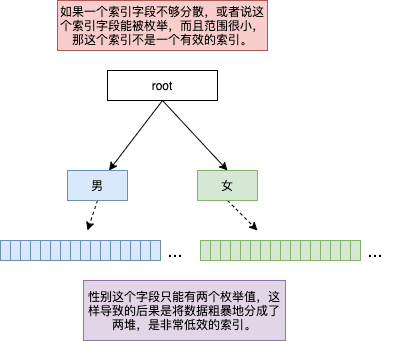
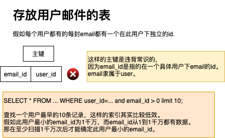

## 数据库索引与设计

### 讨论范围

这里讨论的数据库主要分为关系数据库与部分NOSQL数据库。

### 索引的目的

索引作用主要是将信息线索化，能根据一些输入信息很快地检索出符合条件的数据。假如在关系数据库的一张用户表中，需要查找出用户名为"小明"的用户数据。如果这张表中没有用户名相关的索引，这种查找行为基本上会遍历这张表的数据。这张表数据不多还好，如果数据量很大，比如有上千万条数据，那会相当低效与耗时。这种情况，索引就会派上用场了。   

另外，索引也会被用着数据唯一性的校验，例如关系数据库中的主键与唯一索引(unique)。

### 索引分类

索引本质上就是除了存储数据本身，还额外存储了数据的某些元信息，方便数据查找与检索。一般来说，常用的索引数据结构有：

1. B+ Tree   
   [B+ 树](https://zh.wikipedia.org/wiki/B%2B%E6%A0%91)是一种树数据结构，通常用于数据库和操作系统的文件系统中。B+ 树的特点是能够保持数据稳定有序，其插入与修改拥有较稳定的对数时间复杂度，B+树的算法复杂度为O(logN)。B+树的内结点只存储了key没有存储data，节点的出度大，树的高度小，查找的磁盘寻址次数就少，因此拥有不错的性能。
2. Hash    
   hash表的查找复杂度只有O(1)，索引的检索可以一次定位，不像B+Tree 索引需要从根节点到枝节点，但不支持范围查找，另外在有大量重复键值或者数据量非常大的情况下，哈希索引的效率也是极低的，因为存在所谓的哈希碰撞问题。如果业务场景只需要按某些key去查找单条数据，hash索引是不错的选择，亦即hash索引适合快速定位单条数据，但不是查找某一个范围段的数据。   
3. FULLTEXT  
   全文索引，lucene、elasticsearch的默认索引类型，也叫反向索引、倒排索引，即根据关键字来找到文档。mongodb，mysql现在也支持这种索引类型。  
4. LSM (Log Structured Merge Tree)      
   LSM可以看作有序KV集合，严格意义上，LSM其实不算是某种索引数据结构。而是一种分层，有序，面向磁盘的数据组织思想。在LSM中，所有的写入都是以追加的方式顺序写入，避免了随机写入，从而大幅提高写入效率。在LSM中，所有数据相关的更新(增/删/改)都是以追加的方式记录，例如删除一条数据其实就是新加一条删除数据动作的记录到磁盘中，与传统B+树这类存储引擎不一样，在B+树中，磁盘上这条记录会被真的删除，而不是记录删除这个动作。   
   在LSM中，对数据的操作其实不会马上更新磁盘，而是更新内存，当内存中数据到达一个可以保存的块大小后，会将内存中数据按照数据键值存到磁盘中。这些块一旦被写入到磁盘，就不能更新。当这些块越来越多的时候，LSM又会将这些块合并。合并的过程与将内存中数据存放到块时的逻辑很相似，主要有：  
   - 压缩，假如块1有键值A，块2也有键值A，则只保留键值A最新版本的数据。
   - 删除，假如块1有键值A，记录为添加，块2也有键值A，记录为删除，如果块2是最新版本，即是说，块2的数据是后来产生的，则表明键值A已经被删除，在合并时就可以丢弃键值A的数据。
   - 归并排序，在合并块1与块2时，会将块1与块2的键值与数据依次取出排序后合并成新块。
   LSM中线索化信息是放在数据块头部并顺序放置，查找记录可以在数据块的头部使用二分查找，LSM中存在数据放置在多个块中情况，有可能一个key在多个块中都有记录。为了提高检索效率，一般会在块头部放置布隆过滤器信息，同时会不断合并多个块，来压缩数据。
### 索引的负作用

   索引本质是存储额外的线索化信息方便检索，在数据更新(增/删/改)时，这些额外的信息也需要更新，这意味着更多的磁盘IO。换句话说，索引会影响数据更新的效率。这种影响尤其对B+树结构的索引尤其明显。一言以蔽之，索引会增加系统开销，无论是效率开销还是空间开销。

### 索引的使用场景与设计
   总的来说，索引是对读取优化，对写入增加负担的一个事物。   
   索引的使用场景取决于如何对数据进行检索，简单来说，设计索引需要为最常用的数据检索服务，也就是索引的设计常常取决于"SELECT ... WHERE ..."中的WHERE子句。   
   当然，索引的设计往往也受限于业务系统本身的侧重点。例如，对于一个读多写少的业务，我们可以设计更多合理的索引，提高索引效率。对于写多读少的业务，在索引设计上就需要谨慎了，因为更多的索引会降低写入效率。   
   主键与唯一性索引(unique key)实际上也是索引，只是它不但是索引，还带了一些更多的约束条件。合理的索引设计的主要目的是将效率用在刀刃上，主要是为了避免重复设计索引，已经设计不合理的索引和不需要的索引。    
   事实上，没有一刀切的标准来指导数据库索引设计，这是一个需要在设计时花一些时间推敲的工作，包括清楚与熟悉数据的检索方法(通常以什么维度与过滤条件获取数据)，业务系统中相关数据写入与读取频度等，以及在运维过程中通过类似于慢查询日志的方式分析和迭代。    

   #### 主键与唯一索引
   主键与唯一索引，一般来说，大部分表都是需要主键的，如果一张表没有主键，请仔细思考一下，是否表的字段设计真的合理。如果一张表只有唯一性索引(unique key)，没有主键，请想一下为什么不把这个唯一性索引(unique key)做为主键。   

   #### 时间相关性的索引
   时间相关性的索引，大部分的业务系统可能都会有时间范围检索的需求。很多时候，我们经常会在设计表的时候，如果表中有时间相关的字段，往往都会有一种冲动想为这个字段设计一个索引。这种时候，其实我们还有机会斟酌。

   #### 无用索引
   索引的设计需要将数据分的足够散，如果一个索引只能将数据分成几组，那这个索引是很低效的，这种情况相当于B+树只分杈出了几支粗壮的树干，直接在树干上长满了叶子但缺乏树枝。比如，在用户表中对性别这个字段加上索引就是非常低效的，这种情况只是将数据粗暴地分成了两堆，对真正的检索没有任何实际帮助。

   

   #### 联合索引
   业务场景中在检索数据时常常加上多个字段的限定条件时，需要考虑是否用这多个字段组成联合索引。联合主键与联合唯一性索引(unique key)也是联合索引。联合索引可以理解为将数据分叉或分类的顺序规则，例如联合索引由字段A和字段B组成，字段A排在字段B前面。当写入(增/删/改)数据时，涉及到索引变化是先字段A，再字段B。这样说可能很抽象，举个具体的例子，一张存储用户电子邮件的表，有个联合索引是user_id+email_id，这样数据索引的方式可以理解出先按用户划分，再具体到某个用户邮件对应的email_id。假如这个联合索引是email_id+user_id，那索引的组织方式就是先按email_id划分，再在email_id中划分user_id。虽然这两个联合索引的字段都是一样的，但它们在索引中不同的顺序实际上对应了不同的索引效果。如果查询一个用户具体的email_id对应的邮件，这两个联合索引都可以用，但如果查询一个用户某个email_id范围对应的邮件，则只有user_id+email_id这个联合索引才能派上用场，因为现在检索条件实际上以单个用户为维度，email_id+user_id这个联合索引以email为维度，根本不能锁定在单个用户上。    

   

   #### 一些例子

   case 1. 一个订单系统，往往我们需要订单编号作为主键，另外订单中也会有时间信息，在实际使用中常常也会有按某个时间范围对订单进行检索与统计。为订单表的时间字段加上索引看上去也很合理，加入订单编号是按某种基于时间的规则生成，例如雪花算法，则没有必要为时间字段加上索引，检索数据时可以将时间条件转化成订单id的某个范围就完成此效果了。   
   case 2. 用户电子邮件，如果将用户的电子邮件存放到数据表中，时间这个字段看起来加索引也是非常合理的，但如果一个用户的电子邮件在这个存储系统中是有序号id，并且此序号id是递增且唯一的，如果我们的业务场景又只是检索用户某一段的邮件，假如此数据表中，主键是user_id+email_id，时间这个维度的索引好像对系统也没有太大的帮助。我们假设邮件客户端都按某些邮件id范围来检索，例如邮件客户端上次收到的email_id为1001，它在连接服务器后需要读取1001后100条新邮件，则查询的SQL语句中的WHERE子句只需要带上email_id条件。  
   case 3. 假如现在一张用户订单表有3个字段作为主键，user_id+order_id+version (用户名，订单id，订单修改的版本号)，如果业务场景中需要按用户id和订单id来查询此用户在此订单上所有的版本记录，虽然查询条件中只用到主键联合索引中前两个字段，但主键索引在这种查询中能派上用场。此时，如果在表中加上user_id+order_id的联合索引实际上没有任何意义。  
   case 4. 假如用户订单表中，有user_id, created_time这两个字段，现在有两个索引，user_id和created_time，假如现在查询某个用户在某个时间段内所有的订单记录，这个时候这两个索引的利用不一定有效，事实上，这取决于数据的分布情况以及数据量大小。这种场景，两个单独索引效率肯定不如user_id+created_time这样的联合索引。试想一下，你自己设计一个数据库索引，能怎么讲多个索引利用起来，达到与联合索引一样的效果？如果这个很难，凭什么数据库厂商就能做到。使用多个索引来检索数据可以看作在多个B+树上先找出符合条件的数据，再做笛卡尔交集运算。最重要的是进行交集运算前的数量不能太大，这些求交的笛卡尔集不能差异太大。比如集合A有1000万个元素，集合B有2000万个元素，而A和B的交集实际上只有几个，这意味着检索数据在个位数，但遍历的数据却已经上千万了。可能一个3D B+树对这种情况有用，每个索引对应一个B+树，如果在遍历一个B+树时，可以很容易地跳到另一颗B+树。这个基本上很难做到，意味着索引对应的B+树在更新数据的顺序信息时还需要更新与另外一个B+树相关的线索。顺便插一句，这种技艺就类似将一大堆数据打上不同的标签后能迅速收敛，这种技艺一旦诞生，大数据，AI都会被颠覆，但悲观地说，我觉得数据库厂商做不到，除非我们真正切换一种数据表达的方式与维度。     
   
   #### 索引设计的Tips
   - 合理地设计主键
   - 合理地设计unique key
   - 合理地设计联合索引
   - 新引入索引时，需要考虑业务场景是否需要
   - 新引入索引时，需要考虑现有的索引是否已经满足
   - 建立单字段索引时，需要考虑它真正的用处
   - 测试先行，可以插入大量的数据后使用工具或SQL Explain测试
   - 上线后关注慢查询日志
   
### 数据库索引

#### MySQL
   MySQL的MyISAM和InnoDB引擎都使用B+树作为索引，在8.0之前的版本都不支持倒序(DESC)索引，但从树的遍历来看，只有正序索引没有倒序索引的检索对性能的影响也没到1个数量级的级别(树访问的复杂度级别都在LogN)。在MySQL 8.0后，已经支持倒序索引了，如果业务场景中很多时候是倒序检索数据，用倒序索引更为合适，因为就算效率没有数量级的提升，但总归时提升了效率。

#### MongoDB
   MongoDB采用[B树](https://zh.wikipedia.org/wiki/B%E6%A0%91)作为索引，B树与B+树有细微的不同，B树每个节点都存储数据，B树叶子节点之间没有线索化指针(不明白这个特性的可以参考[线索二叉树](https://zh.wikipedia.org/wiki/%E7%BA%BF%E7%B4%A2%E4%BA%8C%E5%8F%89%E6%A0%91))，而B+树正好相反，只有叶子节点存储数据，叶子节点之间有线索化指针。可以简单将这两者差异视为，B树对单条数据查询更有效率，不一定需要遍历到叶子节点才能找到匹配的数据。B+树对遍历查询更友好，叶子节点之间的线索化指针可以避免遍历过程中节点回溯到上面几层节点。

#### Redis
   Redis所有数据都在内存中，内存中的索引，Redis是通过[跳表](https://zh.wikipedia.org/wiki/%E8%B7%B3%E8%B7%83%E5%88%97%E8%A1%A8)实现的，跳表相比B树/B+树来说，算法比较简单，另外空间消耗也少。B树/B+树则更适合需要有IO交互的场景，跳表则更适合内存操作。
   
#### HBase与Cassandra   
   HBase与Cassandra都是列数据库，某种程度上可以将这两者看作有序的KV数据库。同时，它们又是基于LSM树实现的，根据前面对LSM树索引相关信息的描述，我们能得出的结论是，这类数据库在数据写入时，并不需要更新太多索引信息相关的数据。在检索数据的过程中，某种程度上来说，检索的时间并不可控(它不同与B树或B+树，检索的时间复杂度都在O(LogN))，有些时间可能需要遍历一系列的LSM数据块才能获取到数据。这类LSM索引实际适合写多读少的业务(对写入友好，对读取不友好)，HBase中内存信息的线索化同样也使用了跳表。   
   LSM实际上就是有序Key的集合，对HBase和Cassandra来说，索引其实就是数据中的RowKey+ColKey+Version(行键+列键+版本号)。这类数据库其实并没有显示创建索引的接口，我们可以把数据的行键(一行数据的key，可以理解为ID)，列键(理解为列名)，Version(理解为版本号)看着有序的索引。查找单行数据，顺序扫描多行数据，查找单行中单列数据，顺序扫描单行中多列数据都是可以利用到有序的特性的。   
   大体来说，LSM中有序key都是按二进制字节流排序的，比如[]<[0]<[0,0]<[0,1]<[1]<[1,0]<[1,1]go语言bytes.Compare就是二进制字节流的排序。如果业务系统中需要将顺序扫描放在LSM结构的数据库中，则需要自己将业务中需要的排序方式转化成对应的二进制字节流排序方式。举例来说，如果我们需要将32位无符号整型作为顺序排列的key，如果是升序排列，则在写入数据库时，需要将key转化成4个字节的二进制数组，转化的方式是大端字节序。如果是降序排序，则可以将uint32的最大值减去key后，再转化成4个字节(同样使用大端字节序)的二进制数组。当然32位无符号整数还有别的一些转换成二进制数组的方式，只要转化后二进制比较的顺序是我们期望的顺序即可。
   
#### TiDB
   TiDB看上去和MySQL没有太多的区别，至少从外部接口来说。但在存储引擎这块，TiDB与MySQL的Innodb存储引擎差异还是很大，TiDB并没有开发自己的存储引擎，而将主攻方向放在多Raft组上，TiDB使用了[RocksDB](https://rocksdb.org/)作为其存储引擎。我们可以把TiDB看作是用SQL皮封装的LSM，当然TiDB还是将LSM成功地转变成关系数据库，提供了LSM不具备的多级索引，事务，联合查询等等。   
   从索引的角度看，TiDB并没有与MySQL Innodb一样使用B+树，而是与LSM一样。TiDB与MySQL 8.0不同，并不提供倒序索引。关于倒序索引对遍历的影响，与LSM中数据块分布有很大的关系，后续有时间可以做一些benchmark的测试。   
