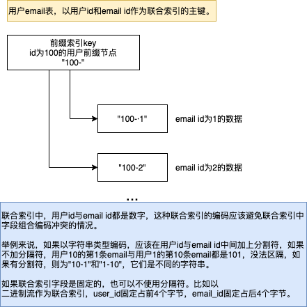
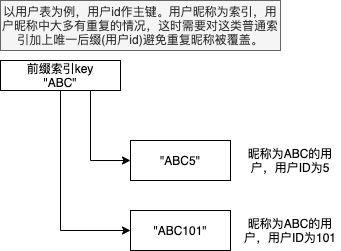

## DIY数据库 -- 了解数据库的另外一个途径

### 前言
    很多时候大家都停留在使用数据库，包括DDL，CRUD，运维与性能调优。但当我们需要理清一个数据库的优劣势、瓶颈与上下限的时候，只是去读一些类似于Innodb原理之类的书和文献也只能做到一知半解，阅读源码也是一个不错的途径，但现在数据库源码都巨大无比。光是了解清楚相关的各种名词与一些常用的数据结构与算法和设计思路，都是需要很多时间。    
    数据库顾名思义就是用于存储数据的，对使用者来说，它屏蔽了实现细节，并让使用者存取数据变得更加高效，便捷和可靠。如果从使用者的角度出发，假如自己设计和实现一套数据库方法，那你会就清楚自己在解决什么问题，遇到的挑战是那些？同时，当你明白数据库相关的开发人员所做的工作与挑战后，你就有很大机会明白一个数据库的能力和短板，并能更好地利用数据库的这些能力避其短板。    

 ### 一个内存数据库
    项目地址 : https://gl.codectn.com/pineal/middleware/-/tree/master/memdb
    项目文档 : https://gl.codectn.com/pineal/middleware/-/tree/master/memdb/doc   

   #### 项目背景    

    这个项目的初衷是想设计一套内存数据库出来，基于IM系统的特征，IM系统在人数很多的群发送消息时会有瞬时很大的写放大过程，如果这些操作直接放到数据库IO中，会导致响应很慢。初始的想法是想设计一种模式，可以将这类临时的冲激平滑。设计一个内存数据库，先将这些大量的数据变更记录在内存中，后面再将这些数据存储到磁盘上，这也是设计此内存数据库的初衷。  总体来说，这是一个实验项目，没有用到生产和开发环境中，主要是后来我们通过消息队列的方式来承接了这样的平滑功能，另外，这种先修改内存再写入磁盘的方式很多数据库都是这样的方式设计的。真正要完成内存先缓存，再存入持久性数据库工作的后，实际上要完成整个链路的可用与可靠性，实际上就相当于自己完整设计了一整套数据库。再后来，引入类似HBase这样的LSM数据库后，数据库的大量写瓶颈问题得到了解决。     
    再后来，这部分存储模块作为了一个类似于[etcd](https://github.com/etcd-io/etcd)的raft存储系统的一部分，可以提供类似于etcd的功能，例如统一的服务配置，服务发现等。当时没有直接采用etcd主要是基于两个考虑:
    1. etcd采用[boltdb](https://github.com/boltdb/bolt)作为其存储引擎，现在etcd已经将boltdb相关代码内置在项目中了。boltdb是一个B+树的存储引擎，直觉上觉得它慢。实际上，mongodb采用B+树作为存储引擎，也并不慢，其实B+树在内存中的操作一点都不慢，存储引擎如果能更多做到避免频繁刷盘，会大大提升效率。当然，刷盘频度如果低了，有数据丢失的风险，所有的这些设计实际上都是各种平衡。    
    2. etcd当时的客户端go语言版本有一些issue。   
    基于这样的考虑，就在一个raft框架上内置了这个内存数据库，主要考虑的是这个raft体系不会保存大量的数据，总体占用内存不高。3节点的raft基本上不会有任何服务宕机风险。基于当时benchmark测试数据，在raft下内存数据库的IOPS (Input/Output Per Second)是8000左右，etcd的IOPS是2000左右。后来，etcd客户端修复了一些issue后，基本上就成了项目中服务配置与服务发现的标配，毕竟它是大量用于生产环境的项目，另外2000左右的IOPS对配置项的读取来说足够了。

   #### 设计目标

  - 支持多表
  - 支持多级索引
  - 支持联合索引
  - 支持正序与倒序索引
  - 支持事务
  - 支持MVCC
  - Schemaless 无类似关系型数据结构定义限制
  - 不支持不同索引之间的复合运算(实际上这是数据库中巨大挑战，除非从根本上改变数据存放的形式才能根本解决问题，个人觉得集合运算是非常难搞的，像极了黑客帝国Matrix)
   
   #### 实施过程

- 适合内存存储的数据结构    
    数据库在检索数据时需要同时提供满足单点的检索速度与顺序检索速度都要快，单点的检索速度Map(Hash)最快，时间复杂度为O(1)，但Map不满足顺序检索条件。考虑一下最主流的两个排序算法，[快速排序](https://zh.wikipedia.org/wiki/%E5%BF%AB%E9%80%9F%E6%8E%92%E5%BA%8F)和[堆排序](https://zh.wikipedia.org/wiki/%E5%A0%86%E6%8E%92%E5%BA%8F)的思想都是可以看成二叉树分治方法，这里说的二叉树方法是指将数据进行不断地二分，并不是说一定要设计成二叉树的数据结构(左，右子树)。我们将排序看成是将一系列数据组织成二叉树后又依次从二叉树中移除的过程，依次移除的数据实际上就是我们想要的排序结果。从这里很直观地可以看出，树是排序的一个中间形态，事实上树是一个基于动态数据排序非常友好的数据结构。好的动态排序的树形结构主要是需要平衡，需要对插入，删除，更新，获取，遍历都要有稳定的时间复杂度，类似这样的树形结构有[AVL树](https://zh.wikipedia.org/wiki/AVL%E6%A0%91)，[红黑树](https://zh.wikipedia.org/wiki/%E7%BA%A2%E9%BB%91%E6%A0%91)，[B树](https://zh.wikipedia.org/wiki/B%E6%A0%91)，[B+树](https://zh.wikipedia.org/wiki/B+%E6%A0%91)等。当然，树的平衡性主要是降低树的深度，避免树退化成链表，如果数据本身没有太大的倾斜，树的深度也不会太深。    

- 开源库搜索
    在go语言的各个开源包中找到了一个开源的前缀树项目, https://github.com/hashicorp/go-immutable-radix，并以它为基础实现内存的存储。选择这个项目主要是基于这个库已经实现了MVCC的功能，不用重复造轮子。  

- [MVCC多版本并发控制](https://zh.wikipedia.org/wiki/%E5%A4%9A%E7%89%88%E6%9C%AC%E5%B9%B6%E5%8F%91%E6%8E%A7%E5%88%B6)   
   MVCC主要目标是提高访问的并发效率，类似于写时复制或无锁算法。读取数据时不用关心现在是否有正在写入数据的过程，假如在写入数据时阻塞了读取数据，整个系统的并发性会降低很多。这种MVCC的原理实际上是，在写入数据时，生成一颗新的子树(这里子树是指因为写入此数据后所有受影响需要调整位置这些节点组成的子树)，在真正写入的时候才替换原来的子树。如果别的读取数据的过程拿到了原来的子树，某种意义上可以看出这个读取过程拿到了旧的子树快照，但并不阻塞读取过程。看上去MVCC好像不算复杂，但实际上针对B树或B+树的无锁算法(MVCC)算法是很复杂的，现在都还有很多提高效率的算法在发表和验证。google有一个[go语言的B树版本](https://github.com/google/btree)，但这个项目并不支持MVCC

- 定义数据格式   
   在确定了索引的数据采用前缀树后，还需要定义数据的组织形式，表定义，索引定义相关的元信息组织形式，同时也需要定义和明确事务的数据结构。

 - 定义操作元语   
   这个项目并不支持SQL语句，而是通过gRPC接口的方式定义出操作元语。

 - 事务的实现   
   这里事务并没有像MySQL那样精确到行级锁以及提供不同的事务隔离级别，而是简单地将事务做串行化，而提交事务时就更新修改后的子树，否则丢弃修改的子树。

 - 索引的本质/联合索引   
   索引实际上就是当用户插入或更新数据时，修改索引字段对应的索引树。索引上树保存的key就是被索引字段的值，如果有多个字段组成的联合索引，则需要拼装这多个字段为一个key，拼装的算法需要避免拼装后键值冲突。
   

 - 主键/唯一索引   
   主键可以是一个字段，也可以是多个字段。如果是多个字段，在插入数据时，会将这多个字段按照设定的顺序拼成一个key，插入到前缀树中。   
   主键和唯一索引的key是唯一的，意味着有排他性，插入一条已经存在的主键数据的行为可以是：1）报主键冲突错 2）覆盖原有数据。  
   唯一索引(unique key)与主键类似。
 
 - 普通索引     
   普通索引，插入数据时，普通索引并不能保证与别的数据行发生冲突，需要在后面拼接上主键才能保证插入数据时不丢失别的数据的线索。而检索时，通过普通索引生成的key，可以迅速定位到与这个前缀匹配的父节点，通过对此父节点下子树的遍历，就到达索引的目的了。
   

 - 多级索引的实现    
   多级索引实际上就是为每个索引建立一颗索引的前缀树，一张表中有几个索引，在写入数据后都会涉及到修改每一个索引对应的前缀树。

   

            