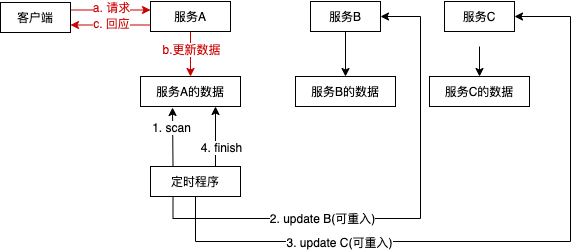
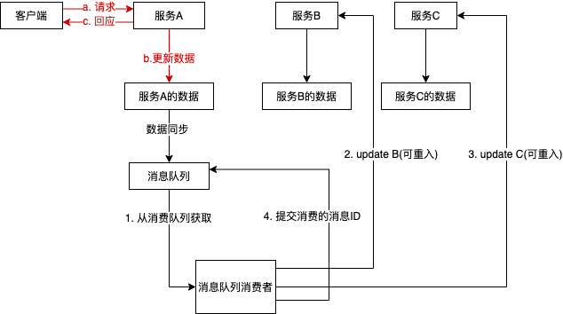
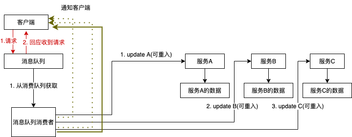
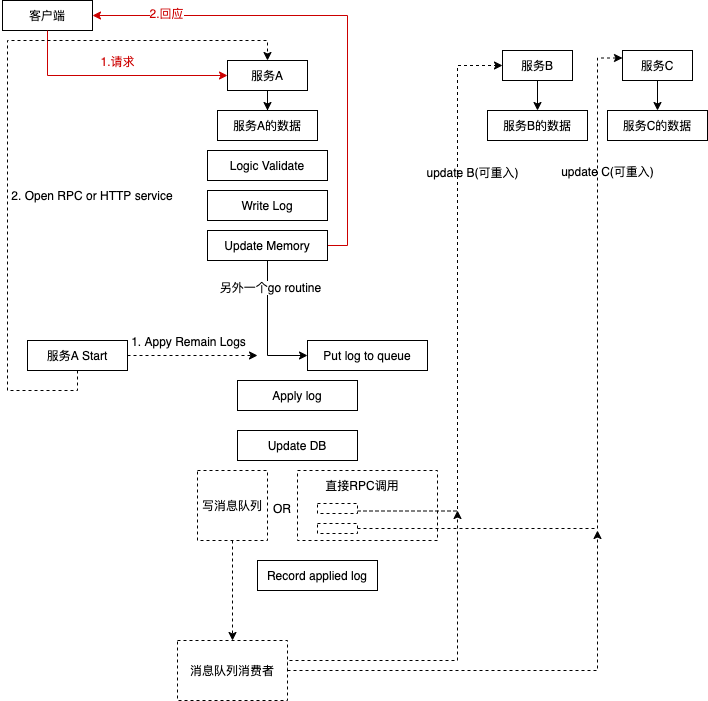

## 多服务异步问题

### 异步问题来源

不同于单体服务，多服务器下会产生一些数据不一致的问题。多服务下数据一致性是比较难的一个问题，本文不会阐述同步解决多服务的数据一致性问题，只阐述使用异步方式来解决数据一致问题。

### 异步处理数据一致性问题的流程

异步处理数据一致性问题的本质类似于WAL，不论是消息队列，定时任务，都是一样的思路。

- 最简单的处理方法是使用定时程序，适合并发数不高，业务不多的场景，这是最方便部署的场景。这也是现阶段电商中采用的方案。

- 折中的方式是采集和监控mysql bin log，这种模式比定时程序更高效，但需要对bin log格式做一些处理，将bin log日志转化成为消息队列中的消息体。

- 全异步模式需要与客户端配合，完成整个链路的异步响应机制。这个方案的实现复杂度比较高，需要设计出一个完善的异步框架和调用规则。

- WAL模式，WAL模式是复杂度比较低，又能兼顾性能的模式。可以将其设计为框架，写日志，应用日志都采用接口的方式，不同的场景只需要实现各自的接口就可以接入。值得注意的是，在应用日志时更新A服务的数据存储可以采用定时更新或到了一定水位线再更新，这样可以有效减少IO频率。另外在更新别的服务相关信息时可以采用消息队列，可以解耦和提高处理的吞吐量。

