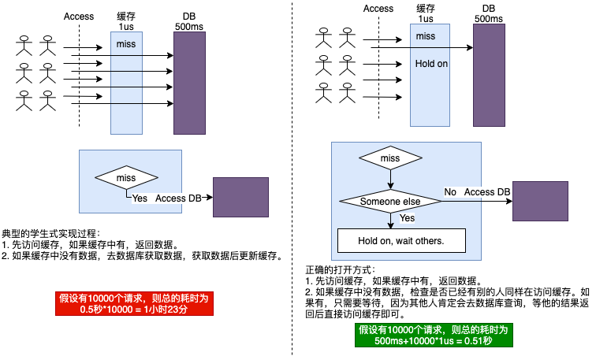

## Cache Snowslide

### 何为缓存雪崩：

缓存雪崩又可以叫缓存击穿，为了提高数据访问的并发量，通常会将数据库或文件（也有可能是别的服务或中间件的数据）的数据缓存在内存中或一些缓存中间件中(Redis/Memcache)，当外部（可能是客户端，也可能是别的服务）来访问这个数据时，速度非常快，可以承受很高的并发访问。反之，如果不访问缓存，则会有很大的IO开销（大部分是磁盘IO，有时也有网络IO，比如访问远端某个服务上的数据）。    
缓存雪崩指的是这样一种情况，缓存中没有对应的数据，而当前又有大量的请求，比如上万个请求访问数据，这些请求如果没有在缓存中找到数据，会直接去数据的源头访问，就产生了上万次的IO开销，出现了挤兑的情况。    

### 解决缓存雪崩

一间公司在进门大厅设置了一台打卡机（假设打卡机是无线可移动的），同时在大厅旁的小房间放了一台备用的打卡机，上班的人在大厅刷一下卡就可以完成打卡。某天早上，大厅的打卡机坏了，结果一群人都冲到旁边的小房间打卡，结果大部分都堵在小房间门口进进出出，浪费了不少时间。这种情况下，最好的办法是第一个发现大厅打卡机坏了的人应该吼一嗓子，对后面的人说，“大厅打卡机坏了，大家等我去把小房间的打卡机搬出来”，当这人把小房间打卡机搬出来后，整个状况又恢复正常，后面的人稍微耐心等待一下就避免了大家都去小房间挤兑的问题。  
解决缓存雪崩的问题其实也是借鉴了上面的思路，当访问缓存时发现没有命中时，并不直接去数据库获取，而是先看是否有另外的人也在访问缓存，如果有，就等待，因为第一个发现缓存没有命中的人肯定或去数据库获取；等这个人获取到数据并更新缓存后，再直接访问缓存即可，这样就避免了多次访问数据库的开销。

  
图1

### 类似代码

``` go

//假定现在有一把读写锁与要获取的key相关
//先加读锁，看是否缓存中已有数据
//如果有，直接返回
rwLock.RLock()
if key exist {
    var value = get from cache
    rwLock.RUnlock()
    return value
}
rwLock.RUnlock()

//缓存中没有，可能需要去数据库获取，记住，这里是可能。
//能去数据库获取的go routine肯定是第一个竞争到了写锁的go routine
//加写锁，这里加写锁的目的是可能会修改到缓存的数据，修改数据肯定要写锁
rwLock.Lock()
//defer执行，保证在函数堆栈退出前释放掉写锁
defer rwLock.Unlock()
//再次检查缓存中是否有数据存在，可能是别的go routine已经从数据库获取到了数据，写回缓存了
//如果缓存中有，就没有必要去数据库获取了
if key exist {
    var value = get from cache
    return value
}

//缓存中没有数据，此时当前go routine需要去数据库获取数据了
var value = get from database
//将获取到的数据写回cache
set value into cache

return value
```

其实不止用读写锁可以解决这样的问题，用同步互斥相关的包都可以解决，比如sync.WaitGroup：

下面有一个google的缓存库就用了这样的思路：

https://github.com/golang/groupcache/blob/master/singleflight/singleflight.go

```go
// call is an in-flight or completed Do call
// 这个结构体用来表示正在调用或已经调用完毕的函数过程
type call struct {
	wg  sync.WaitGroup
	val interface{}
	err error
}

//下面这个函数就利用sync.WaitGroup的方式来解决类似问题
//参数fn可以理解成一个从外部获取数据的函数
//比如fn可以是一个从远端数据库读取数据的函数
func (g *Group) Do(key string, fn func() (interface{}, error)) (interface{}, error) {
	g.mu.Lock()
	if g.m == nil {
		g.m = make(map[string]*call)
	}

	if c, ok := g.m[key]; ok {
		//发现已经有其它go routine已经在访问此数据了
        g.mu.Unlock()
        //等待访问此数据的go routine结束访问
		c.wg.Wait()
		return c.val, c.err
	}

    //准备调用fn来获取数据
    //在调用fn获取数据之前，先对wait group做加1的动作
    //保证后面来访问的go routine必须等调用fn后结束
	c := new(call)
	c.wg.Add(1)
	g.m[key] = c
	g.mu.Unlock()

    //通过调用fn来获取数据
	c.val, c.err = fn()
    //对wait group做减1的动作
    //保证其余等待的go routine在此刻后不用等待并能获取结果
	c.wg.Done()

	g.mu.Lock()
    //清理key，将它从正在访问中移除
	delete(g.m, key)
	g.mu.Unlock()

	return c.val, c.err
}
```

### 一次开源第三方库的踩坑（缓存雪崩）和填坑过程

在项目中，我们用到了HBase这样的中间件，代码中引用到了第三方HBase的go语言驱动。这里所谓驱动的意思就是用go语言实现了读写HBase的库，这类库通常做的事情就是与中间件服务器（比如关系数据库/NOSQL数据库/缓存数据库）通信，主要负责与中间件服务器进行网络连接并管理这些连接，在建立连接后，通过实现与中间件服务器之间的通信协议，并将这些封装成更上层的API，供上层应用调用。   
如何看待开源第三方库，这其实是个非常有趣的问题，“尽信书不如无书”应该是一种不错的态度。开源社区的确对软件行业起到了很大的推动作用，勇于分享的作者都是值得尊重的。“人非圣贤，孰能无过”，没人在代码上永远和绝对正确，对于像Linus这样的大神也不例外，只是这些大神水平极高，可信度大，一般水平的很难找出问题。大神都如此，何况其余人的代码呢。   
当我们使用这些第三方代码时，必要的环节就是测试，粗读代码，细读代码。   

我在使用HBase的go语言驱动时，也是这样类似的过程，先下载，通看一遍代码，知道怎么使用。然后自己编写一些测试用例或测试小程序做一些测试实验。在我写了一个测试程序来测试HBase的吞吐能力（**后端的压力测试相当重要**）的过程中，我就发现了第三方库的缓存雪崩的问题。   

整个问题是这样的，在程序中，我准备了30万条数据写入HBase中，发现大量写入操作都超时。这时就开始怀疑这个库可能有问题了，这时就开始细读这个库的代码，并在一些关键路径上加上自己的log和测量代码，并最终定位出了问题所在。HBase客户端整个写入过程是：

1. 根据对应的表和key，去本地缓存中查找此RPC操作应该发送到哪个Region Server，其中这些表的分片信息是维护在内存中一个B树上作为缓存。
2. 如果缓存中没有找到对应的Region Server信息，并且本地没有存放分片信息的Region Server地址，则需要去Zookeeper服务查找服务地址。
3. 如果缓存中没有找到对应的Region Server信息，但本地有分片信息存放的Region Server地址，则需要去此Region Server获取相关表的分片信息。
4. 在有了相关表的分片信息后，可以根据参数中的key确定对应的Region Server，将RPC请求发往此Region Server。   
其中，从zookeeper或Region Server获取信息的过程中都会伴随网络IO请求，甚至有些时候在这些服务器上还会有一些磁盘IO请求(假如zookeeper或Region Server相关信息并没有在缓存中，不可避免地会从磁盘读取数据)。

   
图2

从图2可以看出，如果缓存中没有找到对应表的分片信息，可能会做3次IO(图2中红色线条中的步骤R1/R2/R3，分别访问zookeeper，存放分片信息的region server，真实存放数据的region server)或2次IO(图2中黄色线条中的步骤Y1/Y2，分别访问存放分片信息的region server，真实存放数据的region server)。而如果缓存命中，则只需要直接访问存放数据的region server(图2中绿色线条)。    

第三方库的问题：HBase go语言驱动的第三方库的问题就是缓存雪崩的问题。在实现上，在发起RPC的时候先去缓存中查找需要路由到的Region Server，如果缓存中没有，则会去Region Server甚至zookeeper中查找信息并没做任何限制。如果测试程序一启动就大量往一张表中写入数据，就触发了缓存雪崩导致的挤兑问题，这些大量的请求都会无脑地去zookeeper和region server查找分片信息。如果在缓存没有命中时，需要去zookeeper和region server查找分片信息时加锁，暂时延迟后面的请求导致的这种无谓查询操作，让它们等待前面的查询结果，就能有效地避免这些问题。

总共添加8行代码就能搞定缓存雪崩问题：

```go
// 在hbase client结构体上添加一个Map
// 这个Map主要是用了存放获取分片信息时的锁
// Map的key是表名(HBase中分片信息是以表为单位的)
// Map的value实际上就是锁
type client struct {
    //节点分片信息cache
	regions keyRegionCache
	...

    // ++ 添加的字段
	//region look map locker
	regionLockMap sync.Map
}

// 在查找分片信息时，利用定义的Map中的锁
// 就能避免海量的IO操作
func (c *client) getRegionForRpc(rpc hrpc.Call) (hrpc.RegionInfo, error) {
	// Check the cache for a region that can handle this request
	// if in cache, return quickly
    if reg := c.getRegionFromCache(rpc.Table(), rpc.Key()); reg != nil {
		return reg, nil
	}

    // +++ 下面4行代码是新加的，就是用来避免缓存雪崩
    // 先试作获取要操作的表的锁，如果获取不到就新建一把锁
	var iLock, _ = c.regionLockMap.LoadOrStore(string(rpc.Table()), &sync.Mutex{})
	var locker = iLock.(*sync.Mutex)
    // 加锁
	locker.Lock()
	defer locker.Unlock()

	for i := 0; i < maxFindRegionTries; i++ {
		// Check the cache for a region that can handle this request
        // +++ 下面3行代码是新加的
        // 此时如果直接从缓存中获取到了分片信息，则表明前面的请求已经获取到了分片信息
		if reg := c.getRegionFromCache(rpc.Table(), rpc.Key()); reg != nil {
			return reg, nil
		}

		if reg, err := c.findRegion(rpc.Context(), rpc.Table(), rpc.Key()); reg != nil {
			return reg, nil
		} else if err != nil {
			return nil, err
		}
	}
	return nil, ErrCannotFindRegion
}

```

### 小结

缓存雪崩问题本质上就是当缓存没有命中时，大量的请求都会路由到缓存背后的数据源去，而这些数据源的访问又是很慢的。实际上，只需要从数据源获取一次数据即可，后面那些获取操作都是不必要的。解决这样问题的思路就是生成一个机制，只需要去数据源获取一次数据，让后面的请求暂时等待，等到从数据源获取数据后再继续。

### 题外一

既然缓存雪崩会导致性能问题，那是不是个安全隐患呢？当然是，攻击者随机捏造一大堆奇怪的key（这些key命中概率很低）后大量发送给服务器的话，服务器会无脑地将这些请求转发到数据源从而导致整个系统性能被大量降低。   
那怎么防范这样的攻击？通用的做法是利用布隆过滤器，一个key通过了布隆过滤器验证，可能存在这个key，也可能不存在这个key，但如果key通不过布隆过滤器验证，它一定不存在。这样，布隆过滤器可以过滤大部分这样的无效请求，现在还有更厉害的[布谷鸟过滤器](https://www.cs.cmu.edu/~dga/papers/cuckoo-conext2014.pdf)。

### 题外二

缓存对一个系统的吞吐量如此重要，那工程实践中是否有缓存相关的一些实践呢？    
还真有！在IM系统中各个服务器利用了局部性原理，把很多常用的信息都缓存在内存中。每次IM后端服务升级都定在半夜(那时用户使用量最低)，但升完级后的上午总会发现系统性能很低(从日志中可以分析出来，另外不同于半夜，上午用户的使用频度高了)。我们针对这种情况开发了专门的工具，在每次半夜服务升完级后，会立即利用这样的工具将近期相关的数据加载的缓存，这样操作之后，在日志上再也没有发现相关性能问题了。
