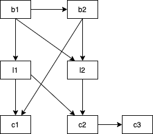
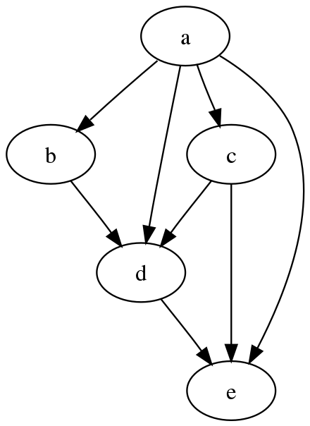
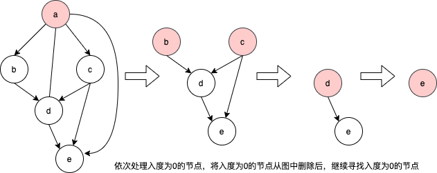

## go语言module文件的引用与打包工具

### go语言module

go的工程中是以go module的方式来管理和引用不同模块包的依赖的，在最早版本的go包管理时，都是将代码放在src目录下，通过将环境变量GOPATH设为src上级目录的方式来完成，后来的版本中又引入了vendor机制来管理第三方包。在go11版本时，引入了go.mod文件来进行包管理。除了早期的一些go项目，现在主流的包管理方式都是go module方式。这里我们主要描述go module的打包方式以及如何开发相关的工具链。

我们先看一个go.mod文件例子：

```go.mod
//声明当前的包名
//格式类似于URL
module gl.codectn.com/imcell/userinfo

//声明需要引用的包名
require (
    //格式为包路径 + 版本号
	github.com/urfave/cli/v2 v2.3.0
	gl.codectn.com/solar/shine v0.2.0
	go.uber.org/zap v1.16.0
	gorm.io/gorm v1.21.2
	gl.codectn.com/imcell/apiuserinfo v0.0.3
)
```

在go.mod中会声明当前工程的包名，如果别的工程需要引用此包，则会引用这里的包命名。同时，如果此包中又需要引用外部的包，则会在require中填写引用的包路径与版本号。这里的版本号格式以v开头，分别以3个数字来表示大小版本，这些数字间以"."号分隔。其中第一位为主版本号，通常意味着在包的某些接口上有变化或某些接口被移除，这种变更一般会导致兼容问题。中间为次版本号，通常意味着在有新接口的增加，但老的接口保持不变。最后一个为修订版本号，通常是一些issue fix，并不涉及到接口的任何变化。在实际中，也不一定完全按照这样的规则来生成版本，但需要明确的是，版本号必须是递增形式。即后面发布的版本号必须：
1. 主版本号大于前面发布的版本 或：
2. 主版本号不变，次版本号大于前面发布的版本 或：
3. 主版本和次版本号不变，修订版本号大于前面发布的版本。

### 包版本发布

代码管理现在都是基于git，无论是github还是自己搭建的gitlab或别的类git平台，发布go module版本本质上其实都是对选定的节点打上对应的tag，例如发布版本号为v1.0.1，实际上就是对相应的git节点打上v1.0.1的tag。
在github和gitlab中通常会使用专门的Release来做发布的动作，这是因为发布版本时通常不止需要打tag(虽然用git命令打上tag版本号在go module机制下就已经生效了)，还需要写上Release Notes来说明此版本基本事项和一些重要事项。例如，此版本修复了某个issue，或改进了某个算法，或此版本某些接口发生了变化和调整。

### go module工具链

不论在哪种开发语言中，包的划分和规划其实都是一个具有挑战性的工作，目标都是"高内聚，低耦合"，亦即是同一个包内的逻辑和代码有非常强的相关性，但对外呈现的接口却要尽可能抽象和简洁。这显然是一个长期演进和迭代的过程，在这个过程中，各个包之间打tag和依赖就非常重要，如果包的依赖关系复杂，则需要开发专门的工具来协助完成这样的工作。

一个例子：现有包b1,b2,l1,l2,c1,c2,c3,其中b1不依赖这些包中的任何包(可能依赖别的第三方包，但在这里没有任何影响)，b2依赖b1，l1依赖b1，l2依赖b1，b2，c1依赖l1，b2，c2依赖l1，l2，c3依赖c2。假如b1的代码发生变化，需要发布新版本，则所有与b1相关的包都有需要发布新版本的必要，从图中可以推出b1发布新版本，所有其余的包也需要发布新版本。假如b2需要发布新版本，则只会影响到l2，c1，c2，c3。这里不止有后续依赖包的版本变更问题，还有一个比较重要的问题需要解决，就是发布版本的顺序问题。假如图中所有包的代码都有更新，都需要发布新版本，我们从图中可以很容易地推导出b1->b2->l1->l2->c1->c2->c3这样一条发布路径是合理的。  

  
      图1

假如我们某一个产品需要做一次升级，则我们需要规划出升级所涉及到的包的版本发布路径。这个工作繁琐而容易出错，需要一个自动化的工具来完成这样的工作。

### 工具链的实现

go多个工程有相互包依赖时的发布打包过程主要分为几步：   
1. 前期准备，各个工程模块在发布前需要进行测试和代码合并，代码合并需要合并到master主分支。
2. 通过各个模块的go.mod文件，梳理出各个工程模块的相互依赖关系。
3. 从依赖关系出发，依次对各个模块进行git相关操作，找出此模块上次发布时的版本号，在上次版本号的基础上递增出新版本号后在打上新版本号tag。

项目地址：
https://gl.codectn.com/server/pm

此项目最早是为了方便管理一个产品代码中多个不同代码仓库而开发的，最开始提供了拉取产品所有相关模块代码及各种git相关操作的功能，主要有：
- 显示产品整体代码结构树
- Pull项目代码
- Push项目代码
- 切换项目代码分支
- 对所有模块的代码进行代码静态检查  

后来由于升级时需要做很多繁琐的各个模块发布相关的工作，又在此项目中加上了自动打tag的功能。   
开发主路径：   
1. 集成git命令，此工具需要通过git命令进行各种操作，需要内置一些git命令在代码中。
2. 解析go.mod文件，go.mod文件某种意义上算是一种[DSL](https://zh.wikipedia.org/wiki/%E9%A2%86%E5%9F%9F%E7%89%B9%E5%AE%9A%E8%AF%AD%E8%A8%80)(domain-specific language，领域描述语言)，有专门的包对其做[AST](https://zh.wikipedia.org/wiki/%E6%8A%BD%E8%B1%A1%E8%AA%9E%E6%B3%95%E6%A8%B9)处理(语法分析)。但实际上它太简单了，用字符串处理和正则表达式就可以完全搞定go.mod文件解析。
3. 确定各个模块发布顺序，依次打tag。

### 利用[DAG](https://en.wikipedia.org/wiki/Directed_acyclic_graph)(有向无环图)确定模块发布顺序

从图1我们可以看出，整个模块依赖我们可以看着是一个有向无环图，如果这个有向图有环，则表明有依赖环存在，在编译中是不允许的，举例说，如果C依赖B，B依赖A，A又依赖C，形成了一个环，这种相互依赖或者在依赖路径上能推导出相互依赖的情况是不允许的。整个求解过程变成了对有向无环图的扫描或者叫拓扑排序，求解的步骤如下：

1. 找出入度为0的节点(没有任何依赖项)放入队列，这里入度和出度是图这种数据结构的概念，入度表示此节点有输入边，出度表示此节点有输出边。
2. 将入度为0的节点放入队列的同时，通过此节点的出度找到其后继节点，删除此后继节点上与刚放入队列的节点的出度边对应的入度边，如果删除对应入度边后此节点的入度为0，再把此后继节点放入队列。
3. 依次重复步骤1，2。

    

图2

以图2为例，先找到入度为0的节点a，放入队列，同时通过a的出度边找到b，d，c，e，移除对应的边后，b入度为0，放入队列，同时把b往d方向的入度边删除，此时d入度不为0，不用放入队列。在处理完移除b节点的事务后，c也是a的入度节点，此时c入度为0，放c入队列，并将c对应到d的出度边删除，此时d的入度为0，d放入队列，d放入对列的同时，移除e对应的一条入度边，e此时入度为0，放入队列。此时队列中的顺序就是整个有向图的拓扑顺序。实际上，这种遍历的方式是深度遍历，也可以广度遍历。在图2中，深度与广度遍历的结果是一样的。

    
图3 依次求出入度为0的节点

### Tips

图与树一样，是数据结构里面很重要的元素。定义这类结构时，可以根据实际情况灵活定义，主要是要定义出顶点，边。用数组+指针，矩阵(二维数组)都可以表示图。

```go
//用数组表示前后节点
type Node struct {
	Index int //在数组中的索引
    Fowards []int //后续节点
	Prvious []int //前缀节点
}

//用链表表示前后节点
type Node struct {
	Index int //在数组中的索引
    Fowards *list.List //后续节点
	Prvious *list.List //前缀节点
}

//用指针组表示前后节点
type Node struct {
    Fowards []*Node //后续节点
	Prvious []*Node //前缀节点
}

//用指针表示前后节点
type Node struct {
    Fowards *Node //后续节点
	Prvious *Node //前缀节点
	NextLink *Node //在后续节点或前缀节点组的下一个节点
	PreviosLink *Node //在后续节点或前缀节点组的上一个节点
}


//整张图 -- 由顶点数组组成
type Graphic []Node

type Matrix [][]int //用矩阵表示图
//元素为0表示没有临接边，为1表示有临接边
```

树和图的算法往往涉及到子问题求解，子问题求解的意思是通过将问题划分为同类型的子问题求解，直观地说，很多子问题求解都能转化成递归求解。当然，递归并不见的是高效的算法，除非有些语言优化了尾递归调用。   
递归问题可以转化为栈这种数据结构来处理，很多语言都有栈的库，go语言更方便，用一个切片就能完成栈的功能。很多算法和数据结构的教科书都有如何将递归问题转化成栈问题的习题，本质上递归其实就是函数调用栈实现的。在利用栈求解的问题中，往往用队列也可以完成。例如图的遍历，用栈是深度遍历，用队列是广度遍历。队列在很多语言也有对应的泛型库，在go语言中用list.List和切片也能实现。   
如果在求解过程中，将子问题结果缓存了，则递归问题(分治算法)也转变成了动态规划算法，即全局的最优解必然也包含子问题的最优解，例如图的最短路径。

### 扩展

有向图的拓扑顺序有时又会变成类似于关键路径的图规划算法，假设我们做的不是打tag的工具，而是编译工具，而多个模块编译实际上可以并行执行并且各个模块编译时间又不相同，这个问题就变成了一个统筹学相关的图问题。现实中一些工作的安排往往也是很多时候可以并行，但有些工作还是依赖于前面工作的完成，这就是一个典型的图路径规划问题。    
如果多个模块编译可以并行执行，但并行的CPU或机器只有几台，但模块又有很多个，这时这个问题就变成了带条件的0-1背包问题，但求解过程大同小异，还是类似于分治和动态规划的方式。    